# UML Creation Templates

Use these as neutral PlantUML-oriented starting patterns. Replace every generic element with evidence from the user's task, code, documents, or observed behavior. Do not copy the example domain names into a real diagram. If the requested renderer has different syntax, preserve the meaning and state any approximation.

## 1. Activity Diagram

Question: what work happens, in what control-flow order, with which decisions, parallel paths, or responsibilities?

Checklist: initial and final nodes, actions, guards, decisions/merges, loops, forks/joins, and swimlanes only when ownership is evidenced.

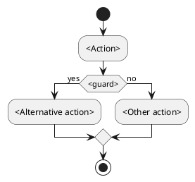

Use a Sequence Diagram when the important fact is message order between participants rather than work control flow.

## 2. Use Case Diagram

Question: who is outside the system boundary, and what goals does the system provide?

Checklist: external actors, explicit system boundary, verb-based use cases, associations, and justified `include` or `extend` relationships.

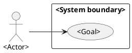

Do not turn internal classes, screens, or implementation methods into use cases unless the source defines them as externally meaningful goals.

## 3. Sequence Diagram

Question: which participant sends each message, in what order, and what happens on alternatives or failures?

Checklist: lifelines, ordered messages, activations where useful, returns, `alt`, `opt`, `loop`, and explicit failure paths when evidenced.

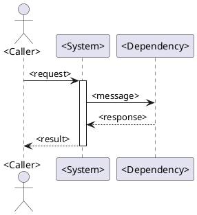

## 4. State Machine Diagram

Question: what states can one entity occupy, and which events, guards, or actions cause transitions?

Checklist: initial state, named stable states, event triggers, guards, transition actions, terminal states, and recovery/error states when supported.

```plantuml
@startuml
[*] --> <Initial state>
<Initial state> --> <Next state> : <event> [<guard>] / <action>
<Next state> --> [*] : <terminal event>
@enduml
```

Do not use a state diagram to show a sequence of independent service calls unless the subject itself changes state.

## 5. Communication Diagram

Question: which participants are linked, and how are their messages numbered across the collaboration?

Checklist: participants, structural links, message direction, numbered messages, and collaboration context. Preserve message numbering; chronology is secondary to connectivity.

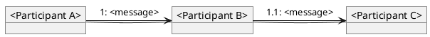

Prefer Sequence when the main question is exact top-to-bottom chronology.

## 6. Interaction Overview Diagram

Question: how does a large orchestration route between detailed interactions?

Checklist: activity-style control flow plus references to named interaction or sequence diagrams, decisions, forks/joins, and clear drill-down labels.

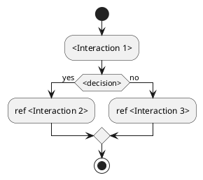

Keep the detailed messages in their own Sequence Diagrams; the overview should remain an index and control-flow view.

## 7. Timing Diagram

Question: how do state or value changes align with an explicit time axis and constraints?

Checklist: participants or lifelines, time units, state/value changes, duration constraints, deadlines, and destruction occurrences where evidenced.

```plantuml
@startuml
robust "<Participant>" as participant
concise "<Signal>" as signal
@0
participant is <State A>
signal is <Value A>
@10
participant is <State B>
signal is <Value B>
@20
participant is <State C>
@enduml
```

Use a Sequence Diagram when message content and ordering matter more than duration or time bounds.

## 8. Class Diagram

Question: what types, attributes, operations, interfaces, and static relationships make up the domain or design?

Checklist: classifiers, visibility where useful, attributes, operations, inheritance, association, aggregation/composition, dependency, and multiplicity.

```plantuml
@startuml
interface <Interface>
class <Class A> {
  <attribute>: <Type>
  <operation>(<parameter>): <ReturnType>
}
class <Class B>
<Interface> <|.. <Class A>
<Class A> "1" *-- "0..*" <Class B>
@enduml
```

Do not infer classes from every noun in prose. Include a classifier only when the source supports a stable type or contract.

## 9. Object Diagram

Question: what concrete instances, values, and links exist in one particular scenario or moment?

Checklist: instance names, classifier types, concrete attribute values, links, and the timestamp or scenario represented.

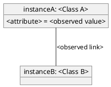

Keep object values tied to an observed fixture, trace, test case, or explicitly supplied example. Do not present made-up values as runtime facts.

## 10. Component Diagram

Question: what replaceable modules or services exist, what contracts do they expose, and what depends on them?

Checklist: components, provided/required interfaces, ports where useful, dependency direction, and external integrations supported by evidence.

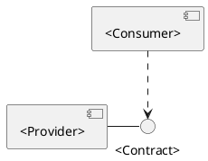

Use a Deployment Diagram when the important distinction is where components run rather than how they are modularized.

## 11. Composite Structure Diagram

Question: what internal parts, roles, ports, and connectors collaborate inside one classifier or component?

Checklist: structured classifier boundary, internal parts, ports, connector direction, required/provided roles, and the external boundary of the collaboration.

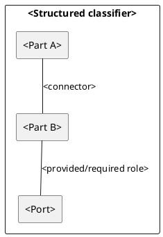

If the renderer cannot express true composite-structure notation, say that the view is a labeled approximation rather than silently calling it complete UML.

## 12. Deployment Diagram

Question: where do software artifacts execute, and how are runtime nodes connected?

Checklist: physical or virtual nodes, execution environments, deployable artifacts, communication paths, protocols, and replication/failover only when evidenced.

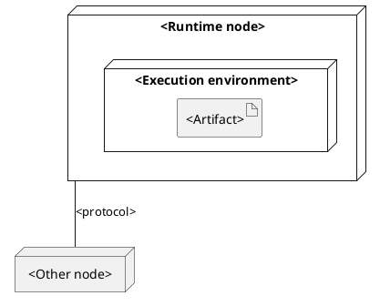

Do not infer production topology from a local development command unless the task explicitly asks for the local environment.

## 13. Package Diagram

Question: how are model or code elements grouped, and which packages depend on which others?

Checklist: package boundaries, contained elements, dependency direction, layering rules, and cycles or forbidden dependencies when evidenced.

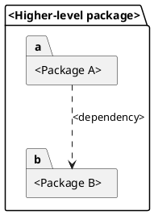

Use Package for logical organization; use Component for runtime or replaceable module contracts.

## 14. Profile Diagram

Question: how is UML extended for a domain-specific modeling vocabulary?

Checklist: profile, extended UML metaclasses, stereotypes, tagged values, constraints, and the domain convention they define.

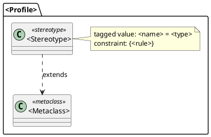

Profiles define a reusable extension mechanism; they are not a substitute for adding arbitrary labels to an ordinary diagram.

## Complete-set consistency checklist

When producing all 14 views from one system, check these correspondences:

- Use Case actors and goals match the external boundary used by Activity and Sequence views.
- Activity actions and Sequence messages describe the same supported workflow; neither adds an unobserved branch.
- State Machine events and states agree with lifecycle transitions shown in Activity or Sequence views.
- Class classifiers, Object instances, Component boundaries, and Package membership use consistent names and ownership.
- Component interfaces map to actual calls or contracts in Sequence and Communication views when those are claimed.
- Deployment artifacts come from the actual build/runtime evidence and map back to components or packages.
- Composite Structure parts and Profile stereotypes are used only when the internal design or domain extension is documented.
- Timing constraints are copied only from measured or specified evidence; do not invent durations to make a Timing Diagram look complete.
