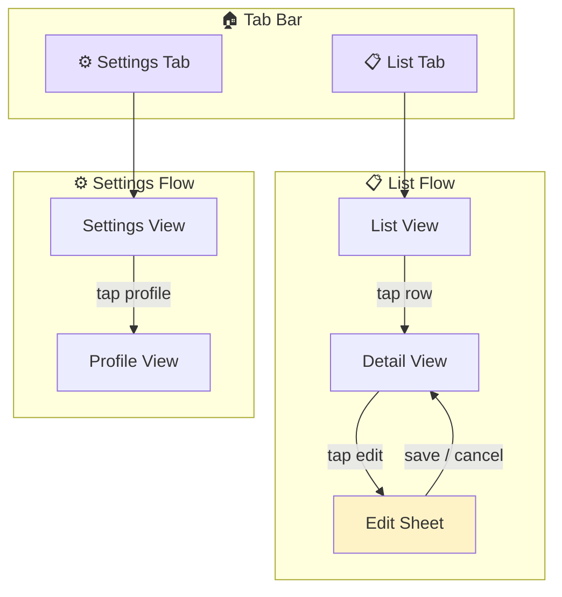
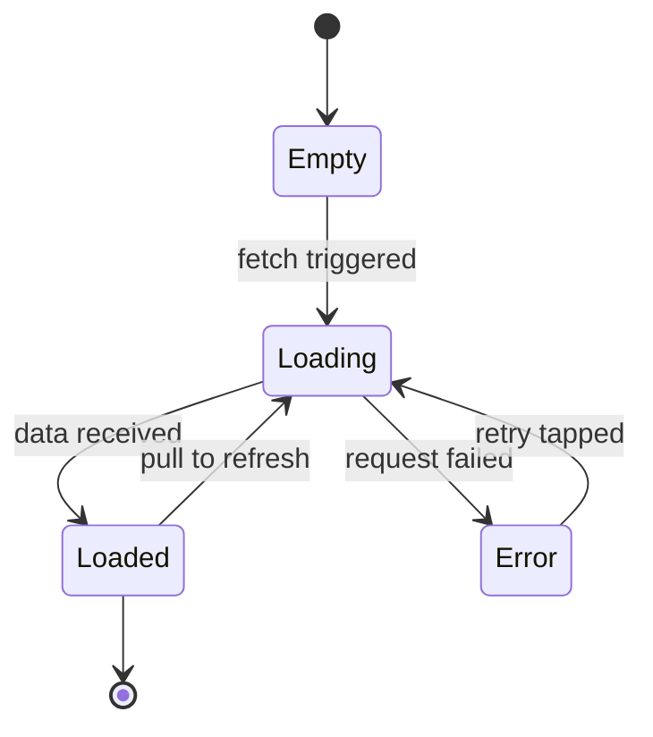
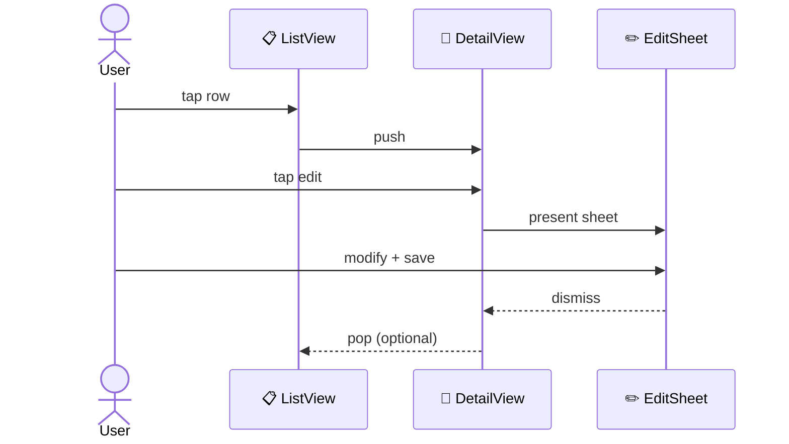

# Knowledge Doc Formatting Rules

Visual formatting conventions for all VisionCapture knowledge base documents. These rules are non-negotiable — derived from the existing knowledge base, not invented.

---

## Rule 1: H1 Title With Emoji Prefix

Every document starts with an emoji + title. Pick the emoji that matches the document type:

| Document Type | Emoji | Example |
|---------------|-------|---------|
| Guide / Overview | 📖 | `# 📖 MCP Modes Guide` |
| Spec / Reference | 📋 | `# 📋 MCP Modes 0.2 Spec` |
| Investigation | 🔍 | `# 🔍 Investigation: Execute Modes and Joined Flow` |
| Architecture / System Map | 🗺️ | `# 🗺️ MCP System Knowledge Map` |
| Diagram | 🔀 or 📊 | `# 🔀 Scout Mode — Full Process` |
| Workflow | 📄 | `# 📄 Workflow Format` |
| MOC (Map of Content) | Topic emoji | `# 🔀 Modes`, `# 🏗️ Architecture` |

---

## Rule 2: Bold Subtitle

Immediately below the H1, add a bold one-line description:

```markdown
# 📖 MCP Modes Guide

**Plain-language overview of all modes — what each does, when to use it, and how they connect**
```

---

## Rule 3: See-Also Blockquote

Non-MOC documents include a `> **See also**:` blockquote near the top linking to the parent MOC and sibling documents:

```markdown
> **See also**: [Modes MOC](../mocs/modes.md) | [Formal Spec](../architecture/mcp-modes-0.2-spec.md) | [Code Flow Diagram](../diagrams/modes-code-flow-mermaid.md)
```

Use relative paths from the document's location. Separate links with ` | `.

---

## Rule 4: Horizontal Rules Between Major Sections

Use `---` between every H2 section to create visual breathing room.

---

## Rule 5: Tables for Structured Data

Never use bullet lists when a table would be clearer. Common table patterns:

- **Mode/feature matrices** — columns: Purpose, Side effects, Session expectation
- **Document inventories** — columns: Document, Path, Lines, Topic
- **Source file references** — columns: File, Lines, Function

---

## Rule 6: Related Section at Bottom

Every document ends with a `## 🔗 Related` section and a footer line:

```markdown
## 🔗 Related

| MOC | What it covers |
|-----|----------------|
| 🏗️ [Architecture](../mocs/architecture.md) | System design, components |
| 🔀 [Modes](../mocs/modes.md) | Mode routing, execution |

---

*Part of the [VisionCapture Knowledge Base](../index.md)*
```

---

## Rule 7: Internal Links Are Standard Markdown

Use standard relative Markdown links — **not** `[[wiki-links]]`:

```markdown
[System Knowledge Map](../architecture/mcp-system-knowledge-map.md)
```

---

## Rule 8: Mermaid Diagram Conventions

Diagram documents use labeled Mermaid code fences with consistent color coding:

| Color | Hex | Meaning |
|-------|-----|---------|
| Green | `#d1fae5` | Success / OK |
| Red | `#fee2e2` | Error / Blocked |
| Purple | `#e8e0ff` | Start / Entry point |
| Blue | `#dbeafe` | Processing steps |
| Yellow | `#fef3c7` | Decision / Loop |

---

## Rule 9: Code Blocks for Paths, Signatures, JSON

Never inline raw file paths or code without backticks. Use fenced code blocks for multi-line examples.

---

## Rule 10: Section-Level Icons on H2 Headers

Use emoji prefixes on H2 headers to make documents scannable and friendly. Pick the icon that best matches the section's purpose:

| Section Purpose | Icon | Example |
|-----------------|------|---------|
| Overview / What this is | 🎯 | `## 🎯 What This Does` |
| Matrix / Feature table | 📊 | `## 📊 Mode Matrix` |
| Flow / How it connects | 🔀 | `## 🔀 Joined Flow` |
| Details / Deep dive | 🔎 | `## 🔎 Mode Details` |
| Configuration / Controls | ⚙️ | `## ⚙️ Configuration Options` |
| Constraints / Rules | 🔒 | `## 🔒 OCR Rule` |
| Errors / Troubleshooting | ❌ | `## ❌ Common Errors` |
| Source files | 📁 | `## 📁 Source References` |
| Request / Data shape | 📦 | `## 📦 Request Shape` |
| Scene / View map | 🗺️ | `## 🗺️ Scene Map` |
| Steps / Process | 📝 | `## 📝 Step-by-Step` |
| Recommended combos | 💡 | `## 💡 Recommended Combinations` |
| Related (always) | 🔗 | `## 🔗 Related` |

**Rules:**
- Every H2 **should** have an icon prefix. Exceptions: very short documents with only 1–2 sections.
- Pick the **closest match** from the table above. If nothing fits, omit the icon rather than inventing one.
- H3 and below do **not** get icons — keep them plain text to avoid visual noise.

---

## Rule 11: Inline Mermaid Diagrams in Non-Diagram Documents

Any knowledge doc (guide, spec, investigation) **may** include inline Mermaid diagrams to explain flows and scene connections. A separate diagram document is not required for small, context-specific diagrams.

**When to inline a diagram:**
- The flow is specific to this document and would not be reused elsewhere
- It helps the reader understand a scene-to-scene or step-by-step connection
- The diagram has fewer than ~15 nodes

**When to create a separate diagram document instead:**
- The diagram is a standalone reference (full mode comparison, system overview)
- Multiple documents would link to it
- The diagram has 15+ nodes and would dominate the host document

**Inline diagram conventions:**
- Use the same color coding from rule 8
- Add a brief `> **Reading this diagram:**` blockquote after the code fence explaining key paths
- Use `flowchart TD` for scene-to-scene flows, `stateDiagram-v2` for state machines

---

## Scene Composition Diagrams

When documenting how views or scenes connect — navigation paths, tab structures, sheet presentations — use these Mermaid patterns. These are the standard templates for scene-level documentation in the knowledge base.

### Pattern 1: Scene Navigation Flow

Shows how a user moves between screens. Use `flowchart TD` with subgraphs for logical groups.

````markdown

````

**Color coding for scene diagrams:**

| Color | Hex | Meaning |
|-------|-----|---------|
| Purple | `#e8e0ff` | Entry point / tab root |
| Blue | `#dbeafe` | Standard screen |
| Yellow | `#fef3c7` | Modal / Sheet |
| Green | `#d1fae5` | Success / Completion screen |
| Red | `#fee2e2` | Error / Blocked state |

### Pattern 2: Scene State Machine

Shows view states and transitions within a single screen. Use `stateDiagram-v2`.

````markdown

````

### Pattern 3: Multi-Scene Sequence

Shows a user journey across screens over time. Use `sequenceDiagram` with participants named after views.

````markdown

````

### When to Use Each Pattern

| Pattern | Best for | Example |
|---------|----------|---------|
| Scene Navigation Flow | Tab structures, push/pop navigation, sheet presentation | "How do users navigate the Workflow Studio?" |
| Scene State Machine | Loading/error/empty states within one screen | "What states does the scout results view have?" |
| Multi-Scene Sequence | Step-by-step user journeys with timing | "What happens when a user starts a learning run?" |

---

## Writing Voice (Non-Negotiable)

These rules are inherited from the project's documentation standard.

### Be Direct, Stay Grounded

Write like explaining to a colleague working on this project. Use plain English but **never leave the project's domain** — reference actual system concepts, actual variable names, actual behavior.

### No External Metaphors or Analogies

**Never use analogies, metaphors, or comparisons to things outside this project.** No GPS, no houses, no roads. Instead, explain actual system behavior more clearly using real variable names and execution flow.

### Separate Facts From Analysis

Clearly distinguish between:
1. **Observed behavior** — confirmed, reproducible
2. **Code-level analysis** — your investigation (can be wrong)
3. **Requirements** — the correct expected behavior

### Anticipate "But Why?" Questions

After code blocks and technical decisions, add a blockquote aside:

```markdown
> **Why not just retry immediately?** Because the element may not be in the view hierarchy yet. The backoff gives the UI time to settle after a navigation transition.
```

---

## MOC Emoji Reference

Use consistent emojis for MOC titles:

| MOC Topic | Emoji |
|-----------|-------|
| Architecture | 🏗️ |
| Modes | 🔀 |
| Sessions | 🔌 |
| Workflows | ⚙️ |
| Diagrams | 📊 |
| Investigations | 🔍 |
