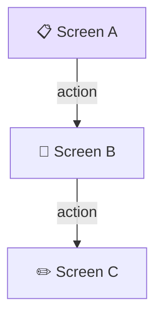
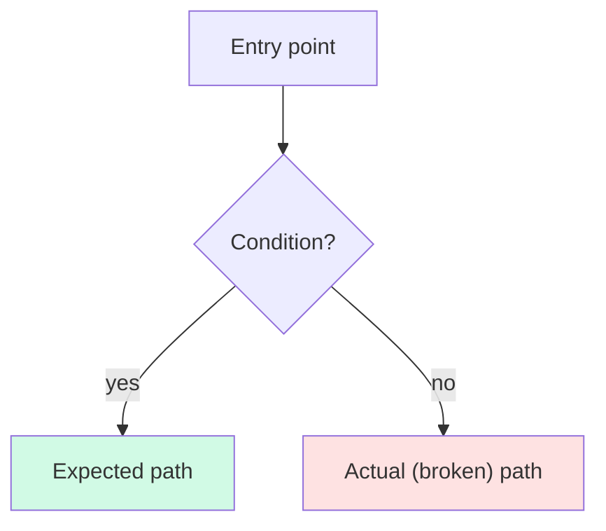
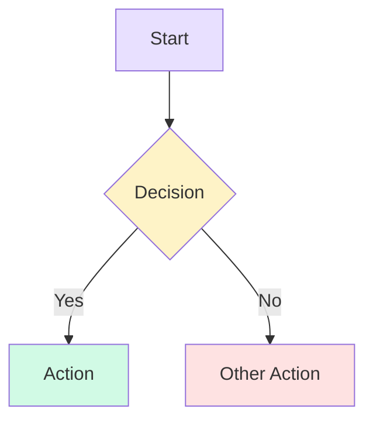

# Knowledge Doc Templates

All 4 document templates for VisionCapture knowledge base articles. Each template is self-contained and ready to copy.

---

## Template: Guide Document

````markdown
# 📖 [Title]

**[One-line description — what this guide covers and who it's for]**

> **See also**: [Parent MOC](../mocs/<topic>.md) | [Related Doc](../path/to/related.md)

---

## 🎯 [What This Does / Overview]

[Content. Use tables for structured data, code blocks for examples, bold for key terms.]

---

## 🔀 [How It Connects — optional inline Mermaid diagram]



> **Reading this diagram:** [Brief explanation of the key paths shown above.]

---

## 🔎 [Section 2 — Descriptive Title]

[Content.]

---

## 📁 Source References

| File | What it defines |
|------|-----------------|
| `Sources/Core/Example.swift:42–68` | [Description] |

---

## 🔗 Related

| MOC | What it covers |
|-----|----------------|
| [emoji] [MOC Name](../mocs/<topic>.md) | [Brief scope] |

---

*Part of the [VisionCapture Knowledge Base](../index.md)*
````

---

## Template: Investigation Document

````markdown
# 🔍 Investigation: [Topic Description]

**[One-line summary of what was investigated and the key finding]**

> **See also**: [Parent MOC](../mocs/investigations.md) | [Related Spec](../path/to/spec.md)

📅 Date: YYYY-MM-DD
🏷️ Status: **Complete** | **In Progress** | **Inconclusive**

---

## 👁️ What Was Observed

[Numbered list of observed behavior — what actually happens.]

1. [Observation 1]
2. [Observation 2]

---

## ✅ What Was Expected

[Numbered list of expected correct behavior.]

1. [Expected 1]
2. [Expected 2]

---

## 🔎 Investigation

[Detailed walkthrough of the code investigation. Use actual variable names, actual values, actual execution flow. Include source file references as tables.]

| File | Lines | What it does |
|------|-------|--------------|
| `Sources/Core/WorkflowEngine.swift` | 142–168 | [Description] |

[Optional: inline Mermaid diagram showing the code flow or scene transitions involved:]



> **Reading this diagram:** Green = expected path, Red = the path that was actually taken.

---

## 💡 Findings

[Summary of root cause or conclusion. Use blockquote asides for "but why?" context.]

> **Why does this happen?** [Explanation grounded in actual code behavior.]

---

## 🔗 Related

| MOC | What it covers |
|-----|----------------|
| 🔍 [Investigations](../mocs/investigations.md) | All investigation reports |

---

*Part of the [VisionCapture Knowledge Base](../index.md)*
````

---

## Template: Diagram Document (Mermaid)

````markdown
# 🔀 [Diagram Title]

**[One-line description of what this diagram shows]**

> **See also**: [Diagrams MOC](../mocs/diagrams.md) | [Related Guide](../path/to/guide.md)

---

## [Diagram Name]



---

## Reading This Diagram

[Brief explanation of the flow, key decision points, and color coding.]

---

## 🔗 Related

| MOC | What it covers |
|-----|----------------|
| 📊 [Diagrams](../mocs/diagrams.md) | All visual references |

---

*Part of the [VisionCapture Knowledge Base](../index.md)*
````

---

## Template: MOC (Map of Content)

```markdown
# [emoji] [Topic Name]

**[One-line scope description — what this MOC covers]**

---

## 🎯 Start Here

- 📖 [Primary Guide](../path/to/guide.md) — [Why to read this first]

---

## 📋 [Category 1]

- [emoji] [Document](../path/to/doc.md) — [One-line description]
- [emoji] [Document](../path/to/doc.md) — [One-line description]

---

## 📊 Visual References

- [emoji] [Diagram](../diagrams/topic-mermaid.md) — [What it shows]

---

## 🔗 Related

| MOC | What it covers |
|-----|----------------|
| [emoji] [Other MOC](./other.md) | [Brief scope] |

---

*Part of the [VisionCapture Knowledge Base](../index.md)*
```
