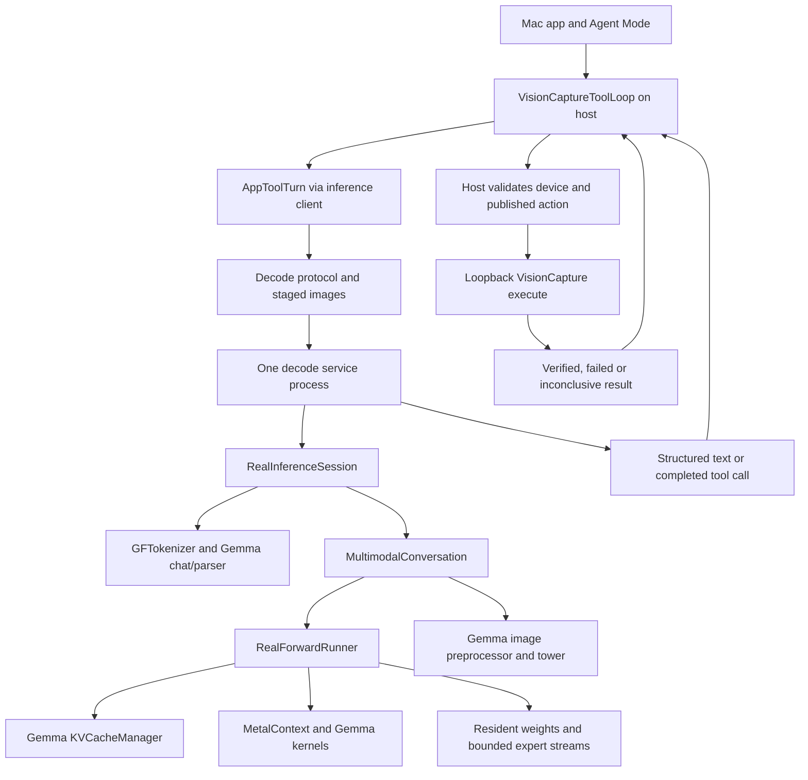
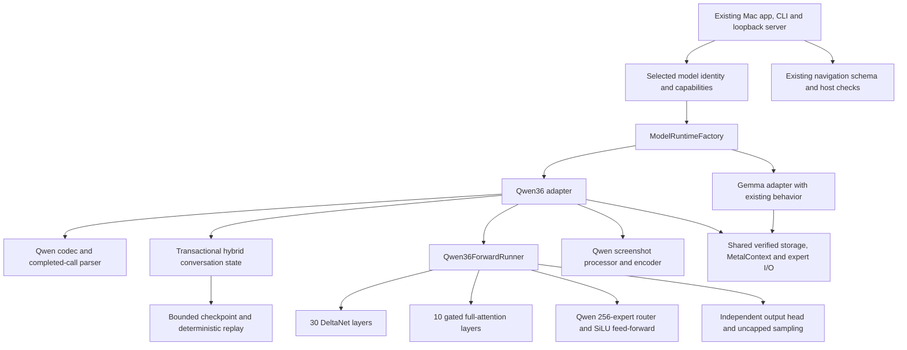

> Owner update, 2026-09-06: “okay, no do not create worktree yet”. The plan now lives in /Users/dev-machine/dev/turbo-fieldfare-personal/Project-files. The earlier planning worktree is being removed after preserving these documents. Earlier requirements to create or retain that worktree are superseded. Do not create another worktree until the owner requests it. The B1 discussion below concerns adopting the current uncommitted iOS implementation into any future implementation checkout. Implementation remains awaiting approval.

# Implementation: Add Qwen for iOS testing

Tracker: [tracker-qwen-ios-integration-2026-09-06.md](./tracker-qwen-ios-integration-2026-09-06.md)
Date: 2026-09-06

---

## Approved scope - version 1

**This is proposed scope awaiting owner approval. Creating this document does not authorize production implementation.**

**Changing anything in this section needs the owner's approval again.** Bump `version` in the tracker and set it back to `awaiting-approval`.

Add Qwen3.6-35B-A3B as a selectable local model in TurboFieldfare for the existing iOS Simulator testing workflow. Implement its Swift and Metal execution, verified streamed installation, still-image processing, chat/tool decoding and conversation recovery. Reuse the existing host navigation boundary. Keep Gemma available with its current behavior. All Qwen work takes place in the dedicated worktree. Acceptance is based on screenshot understanding, valid existing tool actions, verified journey outcomes, response time and memory.

### What changes

1. Model identity selects a Qwen or Gemma loader, codec, runner, state owner and image capability.
2. Qwen receives new recurrent, attention, expert and image calculations with independent reference fixtures.
3. Conversation recovery restores Qwen's complete hybrid state before any model-only retry.
4. The current app, CLI and loopback server use the selected family through narrow runtime interfaces.
5. The owner sees a Model choice and comparable iOS test results.

### What does not change

- Existing Gemma v1 model files, runtime defaults and retained transcript behavior.
- The current Simulator UUID/application lock, exact accessibility selectors, single-call rule and host verification.
- The seven existing action kinds. No new scrolling, coordinate taps, arbitrary execution or physical-device driver is included.
- The separate decode-service process, loopback-only server and ordinary client permission policy.
- No model benchmark for coding, no training, no fine tuning, no full BF16 download, no MTP/speculative decode, no video, no context-extension tuning and no general performance optimization project.
- No production source, installed model or current-branch working file changes during this planning task.

### Files

All paths in task `Touches` cells below are the exact proposed implementation scope. New Qwen paths and tests are proposals, not existing files. The phase coverage plan names every source area and any additional registration file. Existing files are modified only to expose the stated model-family seam.

| Action | File | What |
|---|---|---|
| Create | `Sources/TurboFieldfareFormat/GTurboManifestV2.swift`, `GTurboFormatV2.swift`, `GTurboVisionFormatV2.swift` | Explicit incompatible Qwen family/companion manifests; retain v1 containers only where compatible. |
| Create | `Sources/TurboFieldfare/Infrastructure/ModelIO/ModelFamily.swift`, `Qwen36Configuration.swift` | Model family and validated hybrid geometry/source conventions. |
| Create | `Sources/TurboFieldfare/Runtime/Qwen36/` | Typed weights, runner, prompt processing, hybrid state, checkpoints and conversation adapter. |
| Create | `Sources/TurboFieldfare/Kernels/Qwen36/`, `Sources/TurboFieldfare/Metal/Qwen36/` | Qwen Swift dispatch and Metal kernels, with separately named semantics. |
| Create | `Sources/TurboFieldfare/Runtime/Vision/Qwen36/` | Qwen screenshot preprocessing, image weights, tower, merger and positions. |
| Create | `Sources/TurboFieldfare/Tokenization/Qwen36Tokenizer.swift`, `Qwen36ChatRenderer.swift`, `Qwen36ToolCallParser.swift`, `ModelChatCodec.swift` | Exact pinned chat and tool behavior. |
| Create | `Sources/TurboFieldfareRepack/Core/Qwen36/` | Pinned quantized source, tensor maps and companion installation. |
| Create | `Sources/TurboFieldfare/Runtime/Inference/ModelRuntimeFactory.swift`, `Runtime/Generation/ModelConversation.swift`, `Runtime/Generation/GemmaConversationAdapter.swift` | Narrow selected-model interfaces. |
| Create | `Sources/TurboFieldfareApp/Core/Configuration/ModelCatalog.swift` | Install, capability and settings identity per model. |
| Modify | Existing format/loader, sampling, Metal registration and client paths listed per task | Integrate the selected family without changing Gemma semantics. |
| Create or extend | Exact test/fixture paths in each phase coverage plan | Independent math, transaction and navigation evidence. |
| Modify | `Package.swift` | Register fixture resources when required; existing test directories are discovered by their targets. |
| Create later | `evidence/qwen-ios-integration/phase-<n>/` | Retained proof; never remove with temporary scratch. |
| Delete | none | No important project files are removed. |
| Do not touch | Other source paths and existing user resources | Work outside the listed seams requires revising this scope. |

---

## Problem

TurboFieldfare is a custom Gemma engine. The useful reusable parts are its download transactions, resident tensor storage, bounded expert reads, Metal device/queue management and application shell. The model's mathematics, image pipeline and conversation state are not interchangeable with Qwen.

For the owner, success means the current iOS test loop can use Qwen to inspect screenshots, propose existing accessibility actions and interpret the resulting evidence. The host continues to decide whether an action is allowed and whether its outcome is verified. The model does not acquire new device permissions.

### Worktree and current implementation baseline

| Item | Recorded value |
|---|---|
| Planning worktree | `/Users/dev-machine/dev/turbo-fieldfare-qwen-plan` |
| Planning branch | `codex/qwen-ios-integration-plan` |
| Base commit | `ea02a4a3df1a81936eb539da38e373d7037c2624` |
| Source checkout inspected read-only | `/Users/dev-machine/dev/turbo-fieldfare-personal` |
| Source branch | `codex/visioncapture-mcp-chat-poc` |
| Creation command | `git worktree add -b codex/qwen-ios-integration-plan /Users/dev-machine/dev/turbo-fieldfare-qwen-plan ea02a4a3df1a81936eb539da38e373d7037c2624` |
| Planning disk measurement | `df -k .`: 157,923,120 KiB available immediately after worktree creation; time-dependent, not a reservation. |
| Planning execution | Read-only source/metadata audits and document checks. No model download, inference, build or package tests. |

**The current iOS integration is not contained in the base commit.** Seven `Sources/TurboFieldfareApp/Core/Tools/` files and the inference-trace helper are untracked in the source checkout. The app, conversation, tokenizer and decode-service integrations also have uncommitted changes. Those files were not copied into this planning worktree.

Dependency **B1**: before phase 7 or any host integration changes, make an owner-selected, reviewed snapshot of that existing iOS integration available in the implementation worktree, and record its new base plus file hashes. This is adoption of existing work, not permission to rebuild or broaden the navigation feature. Do not overwrite or silently import every dirty file from the original checkout. The original owner's source work and its verification remain separately attributable. No agent commits or pushes it.

Current-state line references describe the inspected source checkout. Committed files exist at the planning base. Overlay file references exist only in the source checkout until B1 is satisfied. Re-read changing working files before implementation and compare the digest inventory below.

### Current architecture



| Current component | Evidence in inspected source | Implication for Qwen |
|---|---|---|
| Gemma manifest/config | `Sources/TurboFieldfareFormat/GTurboManifestV1.swift:13`; `Sources/TurboFieldfareRepack/Core/Format/ArchInfo.swift:47` | A binary full/sliding mask cannot encode recurrent layers. |
| Gemma forward order | `Sources/TurboFieldfare/Runtime/Inference/RealForwardRunner.swift:76` | New runner; do not rename dimensions in Gemma's sequence. |
| Tied output matrix | `Sources/TurboFieldfare/Runtime/Inference/Model.swift:88` | Qwen has a separate lm_head and unscaled embeddings. |
| Common execution protocols | `Sources/TurboFieldfare/Runtime/Generation/LogitProducer.swift:6` | Reuse logits/prefill seams; introduce narrow family-aware conversation adapters. |
| Shader registration | `Sources/TurboFieldfare/Infrastructure/Metal/MetalContext.swift:131` | Every new module needs explicit registration and unique helper/function names. |
| Expert streams | `Sources/TurboFieldfare/Infrastructure/Streaming/PreadExpertStreamer.swift:56` | Reuse I/O ownership and cache machinery with verified Qwen blob geometry. |
| Cursor-only rewind | `Sources/TurboFieldfare/Runtime/KVCache/KVCacheManager.swift:227` | Insufficient for overwritten recurrent state. |
| Gemma-only probability transform | `Sources/TurboFieldfare/Runtime/Generation/Sampler.swift:134`; `Sources/TurboFieldfare/Metal/Sampling/logit.metal:42` | Add a real uncapped logits path; zero softcap is unsafe. |
| Host inference seam, overlay | `Sources/TurboFieldfareApp/Core/Tools/VisionCaptureToolLoop.swift:103` | Return neutral completed calls through the same closure. |
| Host validation, overlay | `Sources/TurboFieldfareApp/Core/Tools/VisionCaptureToolLoop.swift:525` | Keep exact app/Simulator identity and action evidence checks. |
| Screenshot probe, overlay | `Sources/TurboFieldfareApp/Core/Tools/VisionCaptureToolLoop.swift:684` | Consult selected-model image capability instead of Gemma's companion probe. |
| Model-only retry, overlay | `Sources/TurboFieldfareApp/Core/State/AppModel.swift:2102` | Restoring state must not repeat the external action. |
| Shared sibling settings, overlay | `Sources/TurboFieldfareApp/Core/Configuration/MacAppSettings.swift:121` | Separate preferences by model identity. |

### Target architecture



`ModelRuntimeFactory` is a narrow selection point. Model identity, tokenization, image capability and state identity travel together. It is not a new universal inference framework. The Mac app still owns UI and tool execution while its sibling service owns model/GPU resources. The loopback server remains a separate client route returning proposed calls to its caller.

### Verified Qwen source contracts

| Contract | Verified value or proposed policy |
|---|---|
| Decoder | 40 layers; every fourth layer is gated full attention, the other 30 recurrent; hidden width 2,048. |
| Recurrent projections | Q/K each 16 heads x 128; V/Z each 32 heads x 128; combined QKV width 8,192; scalar A/B per value head. |
| Recurrent memory | FP32 matrix per value head; raw causal-convolution history; kernel width four. |
| Full attention | 16 Q heads, 2 K/V heads, head width 256; partial rotary width 64; scale 1/sqrt(256). |
| Experts | 256 routed, eight selected, one gated shared; intermediate width 512; SiLU in text experts. |
| Output | Untied embeddings/output head; no Gemma embedding scale, FFN sandwich or final softcap. |
| Proposed weight source | MLX affine 4-bit group64, with 8-bit group64 router and shared-expert gates. |
| Image path | Still RGB screenshots; separate Qwen companion; no video or deepstack work. |
| Source verification boundary | Configurations, index and repository metadata inspected. Safetensors header/weight verification is task 1.2, not completed work. |

The proposed MLX source index reports **20,401,929,952 tensor bytes** and its four shard files total **20,402,204,271 bytes**. These are source metadata, not the future .gturbo size or runtime RAM use. Vision keys have no affine companions and the repository reports BF16/U32 types, but exact per-tensor vision dtypes and shapes still need header verification. The selected quantized artifact has split expert projections and no MTP tensors. The official BF16 checkpoint has a different fused layout. Do not infer the import layout from the family name.

| Primary source | Immutable reference |
|---|---|
| Qwen model config | [995ad96 config](https://huggingface.co/Qwen/Qwen3.6-35B-A3B/blob/995ad96eacd98c81ed38be0c5b274b04031597b0/config.json) |
| Qwen image processor | [995ad96 preprocessor](https://huggingface.co/Qwen/Qwen3.6-35B-A3B/blob/995ad96eacd98c81ed38be0c5b274b04031597b0/preprocessor_config.json) |
| Qwen chat template | [995ad96 template](https://huggingface.co/Qwen/Qwen3.6-35B-A3B/blob/995ad96eacd98c81ed38be0c5b274b04031597b0/chat_template.jinja) |
| Proposed MLX config | [38740b8 config](https://huggingface.co/mlx-community/Qwen3.6-35B-A3B-4bit/blob/38740b847e4cb78f352aba30aa41c76e08e6eb46/config.json) |
| Proposed MLX tensor index | [38740b8 index](https://huggingface.co/mlx-community/Qwen3.6-35B-A3B-4bit/blob/38740b847e4cb78f352aba30aa41c76e08e6eb46/model.safetensors.index.json) |
| Transformers model math | [c93057d Qwen3.5 MoE](https://github.com/huggingface/transformers/blob/c93057d4835cd31752bb56f59989dd27696eb45b/src/transformers/models/qwen3_5_moe/modeling_qwen3_5_moe.py) |
| Transformers image patch layout | [c93057d Qwen2 VL processor](https://github.com/huggingface/transformers/blob/c93057d4835cd31752bb56f59989dd27696eb45b/src/transformers/models/qwen2_vl/image_processing_qwen2_vl.py) |
| Apple MLX layer/loading | [6d21ce4 Qwen3.5](https://github.com/ml-explore/mlx-lm/blob/6d21ce4b065a2e163fa6de76a9936c61aeb5784a/mlx_lm/models/qwen3_5.py) |
| Apple MLX recurrence | [6d21ce4 gated delta](https://github.com/ml-explore/mlx-lm/blob/6d21ce4b065a2e163fa6de76a9936c61aeb5784a/mlx_lm/models/gated_delta.py) |
| MLX vision reference | [d506477 vision](https://github.com/Blaizzy/mlx-vlm/blob/d5064772dcd1e31704604f93a873323505ae70d5/mlx_vlm/models/qwen3_vl/vision.py) |

The converter README names mlx-vlm 0.4.4. Inspected current reference source versions are development versions, not a tested installation recipe. The saved `transformers_version` in model config is not a validated minimum. Before creating fixture outputs, record a working pinned reference environment and the exact normalization convention of the chosen artifact.

### Metal execution contract and traps

The first correct implementation uses simple dispatches. Fusion comes later only if measurements justify it. Each production wrapper must state input/output shape, dtype, buffer alignment, valid token range, state ownership, threadgroup size, device requirements and when its command is complete. Check errors before publishing new state. Reuse general matrix kernels where source packing agrees; do not enter a Gemma fast path just because one dimension matches.

| Operation | Initial path | Trap that the fixture must catch |
|---|---|---|
| Embedding/output projection | Generic affine matrix kernels; scale one; independent head | Tied head or sqrt(hidden) silently changes logits. |
| Ordinary norm | Explicit effective-scale convention | Official offset weights need 1+w; converted MLX weights may already contain it. |
| DeltaNet output norm | Direct weight times RMS-normalized values times SiLU(Z) | Adding one or moving the gate before normalization changes the function. |
| Q/K normalization | Chosen reference semantics with explicit epsilon | HF adds 1e-6 to sum of squares; inspected MLX RMS formulation corresponds to 128e-6. |
| Causal convolution | Depthwise width four on raw projected QKV, then SiLU | Do not convolve Z/A/B or cache activated outputs. |
| Recurrent update | FP32 state with fixed axis order | HF uses K-by-V; MLX uses V-by-K. Equal 128 dimensions conceal an error. |
| Full attention Q/gate | Split within each reshaped head | Splitting the full projection vector in half is wrong. |
| Full attention K/V | Separate projections, causal GQA, scale 1/16 | Gemma ties some K/V behavior and uses different norm/scale semantics. |
| Rotary | 64 rotated channels, independent image-grid positions | Token offset and rotary position cease to be identical after images. |
| MoE | Qwen softmax/top8/renormalize, SiLU, sigmoid-gated shared output | Gemma scales and GELU are different mathematics. |
| Sampling | Explicit uncapped transform and ordered penalties | softcap=0 feeds an invalid divide in the current kernel. |
| Image tower | Reference LayerNorm, positional interpolation, image-local attention | Similar tower dimensions do not imply interchangeable Gemma image math. |
| Prefill | Bounded sequential recurrence inside chunks | Carry both convolution history and recurrent matrices across boundaries. |
| I/O overlap | Keep each selected slot alive until dependent completion | A completed CPU read does not mean the GPU finished using its buffer. |

For each value head, using a K-by-V state and column vectors, the required recurrence is:

```text
q = normalize_QK(raw_q, chosen_epsilon) / sqrt(key_width)
k = normalize_QK(raw_k, chosen_epsilon)
beta = sigmoid(b)
g = -exp(A_log) * softplus(a + dt_bias)
S_decay = exp(g) * S_previous
delta = beta * (v - transpose(S_decay) * k)
S_next = S_decay + k * transpose(delta)
o = transpose(S_next) * q
result = RMS_with_direct_weight(o) * SiLU(z)
```

Repeat each Q/K head twice to match the value heads. Decay happens before correction, and readout uses the updated state. The source convention and epsilon discrepancy must be resolved before golden fixtures are frozen. Use official math as a semantic cross-check and the pinned quantized MLX runtime as the practical comparison target. Any deliberate numerical difference is recorded; a large tolerance is not a substitute for choosing the correct function.

A state transaction includes recurrent matrices, raw projected convolution history, valid K/V rows, physical sequence position, rotary delta, rendered history identity and pending tool admission. Keep one committed checkpoint and one working state initially. Only replace the checkpoint after GPU completion. Arbitrary rewind needs replay from retained inputs or explicit lineage invalidation. Replaying a model state never repeats an external action.

### Screenshot contract and resource budget

The still-image processor uses RGB, bicubic resize, dimensions divisible by 32 and `(pixel/255 - 0.5)/0.5`. Its default area limits are 65,536 to 16,777,216 pixels. A still image duplicates the temporal slot, producing 1,536-wide patch vectors. Four spatial patches merge into one language token. These facts come from the pinned processor, not from Gemma image settings.

The tower has learned 48-by-48 positions interpolated with aligned corners plus visual rotary positions. The merger applies LayerNorm per patch, groups four 1,152-wide vectors into 4,608, then dense/GELU/dense to 2,048. Tower and merger GELU variants differ. Images remain isolated in noncausal attention. Text positions after an image follow the visual grid position delta, not simply flattened image-token count.

The host currently limits PNGs to 16 MiB decoded image data, 24 MiB MCP responses, 8,192 pixels per dimension and 16,777,216 pixels total. It retains at most 32 transcript previews. Those are ingress limits, not a safe model image-token budget. Before processing, reserve space for rendered tool history and the output budget. Derive a bounded pixel area from remaining context, use the supported processor resize policy, or reject the request. Never trim image embeddings after silently accepting the original image.

Derived batch-one estimates, excluding padding and scratch:

| Allocation | Calculation | Estimate |
|---|---|---|
| Recurrent state | 30 x 32 x 128 x 128 x 4 bytes | 60 MiB |
| One additional state checkpoint | Same recurrent matrices | Another 60 MiB |
| Raw convolution history at 16 bits | 30 x 3 x 8192 x 2 bytes | 1.40625 MiB |
| Full-attention FP16 KV per token | 10 x 2(K,V) x 2 heads x 256 x 2 bytes | 20 KiB/token |
| KV at 4,096 tokens | 4,096 x 20 KiB | 80 MiB |
| KV at 32,768 tokens | 32,768 x 20 KiB | 640 MiB |
| Resized screenshot example | 1,184 x 2,560 / (16 x 16 x 4) | 2,960 image tokens |

Reproduce these estimates:

```sh
python3 - <<'CALC'
print('recurrent MiB',30*32*128*128*4/2**20)
print('history MiB',30*3*8192*2/2**20)
print('KV bytes per token',10*2*2*256*2)
print('4K KV MiB',4096*10*2*2*256*2/2**20)
print('32K KV MiB',32768*10*2*2*256*2/2**20)
print('image tokens',1184*2560//(16*16*4))
CALC
```

These are estimates from geometry, not measured runtime memory. Add resident text weights, independent head, image weights, command buffers, image scratch, checkpoints and OS page-cache effects. The current ~2 GB Gemma claim does not carry to Qwen. Measure Qwen's actual resident and transient budgets before choosing a supported context/image limit. No new minimum-RAM claim is made in this plan.

### Verification and execution rules

No implementation phase has started. Every planned test mapping below is unverified and remains `missing`. Existing test files can be extended, but adding a Qwen case is still work. Directory coverage rows apply only to the exact touched files listed for that phase. Nine rows in the vision phase keep one screenshot capability together while explicitly covering its registration files.

Run package tests through `Scripts/test.sh`, which forwards arguments to `swift test --no-parallel`. New Swift test files inside existing target directories are discovered automatically here; fixture resource changes still need `Package.swift`. Require a nonzero count of executed tests and no failures. A suite that skips all hardware/model cases is not proof of those cases. Run actual GPU tests only when the existing resource/process checks allow them; model-free host tests can run independently of model installation.

Baseline shared behavior to recheck when its source is touched:

```sh
Scripts/test.sh --filter 'GTurboFormatCompatibilityTests|GTurboManifestCodecTests|GTurboV1StructuralValidatorTests'
Scripts/test.sh --filter 'RemotePayloadCopyTests|RemoteInstallCheckpointTests|RangeCopyPlannerTests'
Scripts/test.sh --filter 'DequantInt4GEMVTests|RouterTopKTests|MoEFusedFFNTests|PrefillGroupedRoutedMoETests'
Scripts/test.sh --filter 'KVCacheManagerTests|MultimodalConversationKVRecoveryTests'
```

Run only the relevant suites per change. Final implementation acceptance includes `Scripts/test.sh` plus release build and the recorded iOS journeys. This planning deliverable requires only document checks, not a runtime build or new unit tests.

The task-tracker checker is inherited from VisionCapture and currently watches `VisionCapture/Sources` paths. That path list does not validate TurboFieldfare source coverage. Run its document checks unchanged, then independently run the complete four-way source union below and map every path to the current phase coverage table. Do not treat an empty VisionCapture-path check as TurboFieldfare coverage. No phase is marked done in this plan.

```bash
QWEN_PHASE_BASE=ea02a4a3df1a81936eb539da38e373d7037c2624
QWEN_PATHS=(Sources Tests Scripts Package.swift)
{
  git diff --name-only "$QWEN_PHASE_BASE"..HEAD -- "${QWEN_PATHS[@]}"
  git diff --name-only -- "${QWEN_PATHS[@]}"
  git diff --name-only --cached -- "${QWEN_PATHS[@]}"
  git ls-files --others --exclude-standard -- "${QWEN_PATHS[@]}"
} | sort -u
git status --porcelain -- "${QWEN_PATHS[@]}"
```

Record a fresh phase base and file/resource inventory before edits. The union includes tests and fixtures; list those as evidence producers under the matching coverage row or add explicit rows before closing. Tests alone do not prove their production target works. A phase closes only with tests exercising the relevant production code, independently sourced expected results, and live/manual proof where specified.

### iOS acceptance and measurement protocol

The current implementation controls an iOS Simulator through published accessibility actions. It is not a physical-device control implementation. Screenshots are read-only evidence and do not grant coordinate actions.

Phase 10 freezes `ios-journeys.json` with six categories: (1) observe and identify the current screen, (2) read small labels and an actual visible error from a screenshot, (3) take one safe published navigation action and verify the destination, (4) enter a disposable value using the exact published editable selector, (5) handle an available native alert through the existing guarded route, and (6) recover from stale/inconclusive evidence or a malformed model reply without replaying an action. Mocked cases always exercise the failure paths. A live category unavailable in the configured app is recorded as unavailable, never manufactured by changing the user's app.

Before any model run: record macOS 26+, Swift 6.2+, hardware/RAM, free disk, `memory_pressure -Q`, completed Gemma installation, completed selected Qwen text/vision packs and absence of every model-owning process named in AGENTS.md. If any condition fails, report it and stop that run. Do not terminate an existing model process or repair/delete a model to force a run.

```sh
git rev-parse HEAD
git status --short
sw_vers
swift --version
df -k .
memory_pressure -Q
system_profiler SPHardwareDataType | awk -F': ' '/Model Name|Model Identifier|Chip|Total Number of Cores|Memory/ { print $1 ": " $2 }'
pgrep -fl 'TurboFieldfareServer|TurboFieldfareMac|TurboFieldfareDecodeService|TurboFieldfareCLI|TurboFieldfarePackageTests|swiftpm-testing-helper|mlx_lm|mlx-lm'
```

Capture existing device/worktree inventory read-only before starting a phase. Run one model-owning product at a time. Build release once after code is ready and use the sibling decode service. Keep existing defaults and experimental/profiling controls unchanged except the explicit selected-family recipe. Do not duplicate a model or stage the full official checkpoint. The user explicitly authorized this dedicated worktree, overriding the repository's restriction against creating worktrees merely to run tests.

For each eligible journey, record one warmup separately and three measured runs per model from equivalent starting state. Use the same Mac, app build, Simulator, evidence inputs, action/output budgets and context capacity. Record actual prompt/image/output tokens because tokenizers differ. Keep per-family sampling and thinking settings visible. If a model needs a different image cap/context to run, report it as a changed condition and keep that comparison separate.

Measure first useful decision latency from submission of observation/screenshot to a complete validated tool call or useful final response. Measure screenshot preprocessing/encoding time, complete journey duration, generated tokens/sec and peak memory with counter definitions. CPU RSS, GPU allocations and physical footprint are different counters; never present their ratio as direct memory savings. Use full tool traces to count task completion, false pass claims, wrong/rejected proposals, inconclusive outcomes, retries and repeated no-progress stops. An uncertain external result requires observation/recovery, not replay.

The community benchmark guide remains mandatory for any public TurboFieldfare text throughput row. These iOS journeys are a separate workload and do not satisfy that guide. Label every measurement as an iOS journey, report the full exact invocation or recorded app settings/action transcript, exit/error/stop outcome, timing footer if present, and all protocol deviations. No public performance ceiling, replacement decision or low-memory claim is inferred from these results alone.

### Source overlay inventory

The following source files were hashed read-only during planning. They are not part of this worktree's base. This records which working implementation was inspected; it is not a patch and does not authorize copying unrelated changes.

| Source checkout path | SHA-256 at planning |
|---|---|
| `Sources/TurboFieldfare/Runtime/Generation/MultimodalConversation.swift` | `3333e01efe62b3f7e5ebf2fa70ab5c14e928d2cafd5babe44a9d0031cd37c5db` |
| `Sources/TurboFieldfare/Runtime/Inference/RealForwardRunner.swift` | `e462d1894e3e552066c24310d808ff350ebc6ff178ab97c6d715580537d9717b` |
| `Sources/TurboFieldfare/Runtime/Vision/MultimodalPromptRenderer.swift` | `a05f05b40349c9e56608560260efbf04ff3be96fa88d88e08d7a1392e08c0b37` |
| `Sources/TurboFieldfare/Tokenization/GemmaToolCallParser.swift` | `1aa7ab0abde2054b2739780214cf35d052dfdda5312dfef0bcadb5a067f3a94f` |
| `Sources/TurboFieldfare/Tokenization/StructuredAssistantDecoder.swift` | `9c39203dae259febd2efb50f33e43ee5f0d3da7429a92d3bfff15a1a6846b3d1` |
| `Sources/TurboFieldfare/Tokenization/Tokenizer.swift` | `2fcedc9927d970f107fec68f9730689af29141486de1c8cf66bfb6db9ae54638` |
| `Sources/TurboFieldfareApp/Core/Configuration/MacAppSettings.swift` | `2ccffcb4391e9c4290ddc5571eeccc1f068bf8f03175ae0cf5f9cfefb571533d` |
| `Sources/TurboFieldfareApp/Core/Diagnostics/AgentInferenceTrace.swift` | `081d6d34575784007b4f7dcf69dde575c28a9851c79fad0da86caf3bc218a0a9` |
| `Sources/TurboFieldfareApp/Core/Diagnostics/AppDiagnostics.swift` | `a01fa02115f0c9b975d21cf7520d9f84ffc40942df23014c71a011d7ad6fc2bd` |
| `Sources/TurboFieldfareApp/Core/Inference/AppGenerationRequest.swift` | `76e54a1da3e7cffd8f250c8110e08e0f96740ad463b6cf6378fb4d27d77c2faa` |
| `Sources/TurboFieldfareApp/Core/Inference/AppInferenceError.swift` | `18f5c522145bbd0ef63113d9c69c2f1133894207b56363c98cd4ce45552996f3` |
| `Sources/TurboFieldfareApp/Core/Inference/DecodeServiceInferenceClient.swift` | `dbea41c37a1ee428624d2ced37ffe3d2358dea7d3b4766b72ba3a081e41b16ae` |
| `Sources/TurboFieldfareApp/Core/Inference/RealInferenceClient.swift` | `6f19043234da2cfa9a4cc4f518ee2075c6601b15798638e3e133243f3c5196c7` |
| `Sources/TurboFieldfareApp/Core/State/AppModel.swift` | `a40b5aee01b94f61859eb95847ac7c5f79737e4136072787b03ea58c2458f775` |
| `Sources/TurboFieldfareApp/Core/Tools/VisionCaptureActivity.swift` | `ad554c0e5bac5ad4e0ee2079460eaa1b149e1a2b3ec585a5d00f19f126538d1d` |
| `Sources/TurboFieldfareApp/Core/Tools/VisionCaptureMCPClient.swift` | `63e815ad60b4032da444ff4dd24cea2cb13fa1847e3f6124063540747513a7ba` |
| `Sources/TurboFieldfareApp/Core/Tools/VisionCaptureScreenFacts.swift` | `bae1afdc6645ea766b92bfc396a529a7a1d4ae20bac296dc995fd0f429efdb1b` |
| `Sources/TurboFieldfareApp/Core/Tools/VisionCaptureScreenshot.swift` | `049cf2b5c014c83a451d39a9fc99b286107ed95c2ecc7877c7972761425a3772` |
| `Sources/TurboFieldfareApp/Core/Tools/VisionCaptureSkillReader.swift` | `a362445279051a962d33493c6d464fe80151fb7c0420fa6a11f28030d5a241ed` |
| `Sources/TurboFieldfareApp/Core/Tools/VisionCaptureToolDefinitions.swift` | `761fba40342fb26227102abe68e2ef4a21e855ca0ee45d6220cb369d0df71244` |
| `Sources/TurboFieldfareApp/Core/Tools/VisionCaptureToolLoop.swift` | `33fa3798a05544ed85d1a615d1cc0d6890bb7ce1934cecd74ef684b13878baa7` |
| `Sources/TurboFieldfareApp/Mac/Diagnostics/InspectorView.swift` | `f8e9c6d8489fa6657cceea4c56be8e57ef85f9cdb1c64a7b73eaba7e67653385` |
| `Sources/TurboFieldfareApp/Mac/Diagnostics/RunnerDiagnosticsSection.swift` | `adc19253453fc758409fae82e81b6493158143066cd4708314aceb6d08744c15` |
| `Sources/TurboFieldfareApp/Mac/Generation/OutputPaneView.swift` | `e0eb9c65ef9ba9b4b54552746f9178b66108ae90f1ea43016d3a5c6c84d6888a` |
| `Sources/TurboFieldfareApp/MacPresentation/InstructionTranscriptDocumentController.swift` | `53261bfc13c00b3ed081226379945f18ebd85168e3d16e9903e526afa2875912` |
| `Sources/TurboFieldfareDecodeProtocol/DecodeProtocol.swift` | `5e7a581429c33ae926e8ca87bc23e3fd04a0980eeebee364d1b833d15732b9c1` |
| `Sources/TurboFieldfareDecodeService/DecodeServiceOutbox.swift` | `417a971d68ead1daef7a34964d0249698c42f8467a0875ff02746303932ed862` |
| `Sources/TurboFieldfareDecodeService/Entry.swift` | `40a4dffe61631f4efa364b49b1f113456f0bf5f6f213257dd175e513083050c6` |

## Phase order

```text
1 Verified Qwen pack
  +--> 2 Exact chat history
  +--> 3 Recurrent Metal memory
  +--> 4 Gated full attention
  +--> 5 Streamed Qwen experts
          |
2 + 3 + 4 + 5 --> 6 Text generation
                        |
                  B1 + 7 Conversation recovery
                        |
                     8 Screenshots
                        |
                     9 Client selection
                        |
                    10 Existing iOS loop
                        |
                    11 Recorded iOS outcomes
```

Phases 2, 3, 4 and 5 can progress independently after phase 1. Coordinate shared `MetalContext.swift` and `Package.swift` edits serially. All model/GPU execution stays serial. B1 must be satisfied before phase 7 starts. These are capability phases, not separate requests to begin implementation.

## Risks

| Risk | Impact | What we do about it |
|---|---|---|
| The dirty iOS implementation is absent from the worktree | high | B1 pins the reviewed overlay before conversation/host integration. |
| Converted norm weights receive an extra +1 | high | Record source convention; verify bounded norm samples and independent fixtures. |
| HF/MLX Q/K epsilon differences look like Metal error | high | Freeze a declared reference policy before comparing outputs. |
| DeltaNet state is restored by a cursor-only rewind | high | Whole-state checkpoint/replay and fail-closed lineage recovery. |
| A retry repeats a device action | high | Preserve the host action ledger; model-only retry fixtures. |
| Image token counts or rotary deltas drift | high | Exact reference pixel/patch/token/position fixtures and admission budget. |
| Vision attention exceeds memory | high | Bound image area/context and tile temporary attention work. |
| An expert slot is overwritten before GPU completion | high | Existing ownership contract plus in-flight read fixtures. |
| Large context or vision erases the memory benefit | high | Budget every allocation and measure supported limits. |
| New format is accepted as Gemma by old readers | high | Incompatible Qwen major version and explicit family rejection tests. |
| Strong text scores hide poor iOS behavior | medium | Judge existing screenshot/action journeys, including failures. |
| A named test filter executes nothing | medium | Require nonzero execution evidence; distinguish skips from passes. |

## Owners

| Short name | Full role and any constraint |
|---|---|
| `unassigned` | Implementation owner is not assigned. Plan approval and phase entry conditions precede source work. |
| `Hebert` | Owner reviews scope and model usefulness; commits and publishing remain his decisions. |
| `reviewer` | Reviews reference semantics, GPU/state correctness and actual test evidence independently of the implementation. |

---
<a id="phase-1"></a>

## Phase 1 - Qwen installs as a verified model pack

**When this is done:** A family-tagged Qwen text pack is installed by the existing bounded range downloader. The loader identifies its architecture before creating Metal state. Gemma v1 remains readable byte-for-byte. A Qwen pack must be rejected by old readers, rather than interpreted as Gemma.

Needs: `-`
Base commit: `pending - capture when phase 1 starts`
Disk baseline: `pending - capture before phase 1 creates resources`
Evidence: `pending - planned evidence/qwen-ios-integration/phase-1/`

### Current state

`Sources/TurboFieldfareRepack/Core/Remote/SupportedModelSource.swift:4` pins Gemma. `Sources/TurboFieldfareRepack/Core/Format/ArchInfo.swift:47` maps every non-full layer to sliding attention. `Sources/TurboFieldfare/Infrastructure/ModelIO/ModelTypes.swift:6` and `Sources/TurboFieldfareFormat/GTurboManifestV1.swift:13` describe Gemma geometry. These paths are committed in the planning base.

### Target state

A family-tagged Qwen text pack is installed by the existing bounded range downloader. The loader identifies its architecture before creating Metal state. Gemma v1 remains readable byte-for-byte. A Qwen pack must be rejected by old readers, rather than interpreted as Gemma.

### Tasks

#### 1.1 Add GTurboManifestV2.swift so Qwen layers stay explicit.

| | |
|---|---|
| Touches | `Sources/TurboFieldfareFormat/GTurboManifestV2.swift`, `Sources/TurboFieldfareFormat/GTurboFormatV2.swift`, `Sources/TurboFieldfare/Infrastructure/ModelIO/ModelFamily.swift`, `Sources/TurboFieldfare/Infrastructure/ModelIO/Qwen36Configuration.swift` |
| Depends on | nothing |
| Parallel safe | yes |

Define a new incompatible manifest major version for Qwen while keeping existing v1 codecs and fixtures frozen. Reuse resident/expert binary containers only where their contracts fit. Store family, 40 explicit layer kinds, attention and recurrent dimensions, convolution width, rotary configuration, independent head, quantization identities, required tensor roles and source hashes. Define strict dimensions, overflow-safe size arithmetic and supported-value validation. Reject unknown families, missing state metadata and unsupported versions before allocating GPU buffers. Do not encode linear_attention as a sliding-window mask bit.

**Acceptance detail**

- [ ] Gemma v1 fixture bytes remain unchanged.
- [ ] Qwen linear layers survive a metadata round trip and old readers reject v2.

**How to check**

```sh
Scripts/test.sh --filter Qwen36FormatTests
```

The command is planned, not executed. Read the complete nonzero test count and retain the output; also apply the task-specific acceptance detail.

**Evidence**

Pending. Record command/settings, result and retained output under `evidence/qwen-ios-integration/phase-1/` when executed.

#### 1.2 Pin Qwen36SourceAdapter.swift for reproducible downloads.

| | |
|---|---|
| Touches | `Sources/TurboFieldfareRepack/Core/Qwen36/Qwen36SourceAdapter.swift`, `Sources/TurboFieldfareRepack/Core/Remote/SupportedModelSource.swift`, `Sources/TurboFieldfareRepack/Core/Remote/RemoteSnapshotLoader.swift` |
| Depends on | 1.1 |
| Parallel safe | no |

Add the proposed MLX source revision recorded in the reference table. Fetch only bounded configuration, tokenizer assets, index and Safetensors headers before planning weight ranges. Verify tensor dtype, shape, shard offsets, scale/bias axes and group size from headers, not repository tags. The metadata-only audit has not verified those headers yet. Keep the official BF16 checkpoint as a reference specification, not a download target. Require the independent lm_head and 8-bit router/shared-expert gates. Exclude MTP weights and declare that base-generation choice.

**Acceptance detail**

- [ ] The install plan records one immutable source and quantization fingerprint.
- [ ] An unexpected tensor header or source revision stops installation.

**How to check**

```sh
Scripts/test.sh --filter Qwen36SourceAdapterTests
```

The command is planned, not executed. Read the complete nonzero test count and retain the output; also apply the task-specific acceptance detail.

**Evidence**

Pending. Record command/settings, result and retained output under `evidence/qwen-ios-integration/phase-1/` when executed.

#### 1.3 Map Qwen tensors in RepackPlanner.swift without requantizing.

| | |
|---|---|
| Touches | `Sources/TurboFieldfareRepack/Core/Planning/RepackPlanner.swift`, `Sources/TurboFieldfareRepack/Core/Qwen36/Qwen36TensorMap.swift`, `Sources/TurboFieldfareRepack/Core/Writing/ResidentWriter.swift`, `Sources/TurboFieldfareRepack/Core/Remote/RemoteStreamingRepacker.swift` |
| Depends on | 1.2 |
| Parallel safe | no |

Map the selected quantized source into named resident tensors and per-layer routed-expert blobs. Discover whether gate/up are fused or split from the selected index and headers. Slice along the verified expert/output dimensions, preserving packed nibbles and every affine scale/bias without changing precision. Cover 40 layers and expert IDs 0 through 255. Reuse bounded copying, hashes, source-bound resume checkpoints, disk reservation and final atomic publication. Compute separate resident, streamed, image-pack and temporary byte totals before asking the owner to install. Do not stage the complete checkpoint or duplicate existing Gemma packs.

**Acceptance detail**

- [ ] Expert 255 reads the correct gate/up/down bytes and metadata.
- [ ] Interrupted installation resumes verified ranges without publishing a partial pack.

**How to check**

```sh
Scripts/test.sh --filter Qwen36RepackTests
```

The command is planned, not executed. Read the complete nonzero test count and retain the output; also apply the task-specific acceptance detail.

**Evidence**

Pending. Record command/settings, result and retained output under `evidence/qwen-ios-integration/phase-1/` when executed.

#### 1.4 Dispatch ModelLoader.swift by family to reject mixed packs.

| | |
|---|---|
| Touches | `Sources/TurboFieldfare/Infrastructure/ModelIO/ModelLoader.swift`, `Sources/TurboFieldfare/Infrastructure/ModelIO/ModelRuntimeSchema.swift`, `Sources/TurboFieldfare/Infrastructure/ModelIO/ManifestReader.swift`, `Sources/TurboFieldfare/Runtime/Qwen36/Qwen36Model.swift` |
| Depends on | 1.3 |
| Parallel safe | no |

Introduce typed Qwen weight access backed by the shared resident/expert storage machinery. Resolve the independent output head explicitly. Validate all required tensors and metadata before exposing a loaded model. Bind receipts and capabilities to family, source revision and content hashes. Keep the existing public Gemma load behavior through the v1 route. A Qwen text pack is usable without vision for text operations, but reports images unavailable until its matching companion passes verification.

**Acceptance detail**

- [ ] A mismatched head, family or tensor dimension fails with a clear error.
- [ ] Both Gemma v1 and a synthetic Qwen v2 pack select the correct loader.

**How to check**

```sh
Scripts/test.sh --filter Qwen36ModelLoaderTests
```

The command is planned, not executed. Read the complete nonzero test count and retain the output; also apply the task-specific acceptance detail.

**Evidence**

Pending. Record command/settings, result and retained output under `evidence/qwen-ios-integration/phase-1/` when executed.

### Phase 1 coverage plan

The first two columns are copied into the tracker. `none yet` means Qwen coverage has not been implemented or verified. Intended test files below are planned new files or planned extensions to an existing suite.

| Code this phase changes | Test file that must cover it | What the test must prove | Command |
|---|---|---|---|
| `Sources/TurboFieldfareFormat/` | none yet | Planned: `Tests/TurboFieldfareFormat/Qwen36FormatTests.swift`. Major-version rejection, mixed-family metadata, overflow and frozen v1 fixtures. | `Scripts/test.sh --filter Qwen36FormatTests` |
| `Sources/TurboFieldfareRepack/Core/` | none yet | Planned: `Tests/TurboFieldfareRepack/Core/Qwen36RepackTests.swift`. Pinned source headers, byte-preserving tensor slicing, exact resume and publication. | `Scripts/test.sh --filter Qwen36RepackTests` |
| `Sources/TurboFieldfare/Infrastructure/ModelIO/` | none yet | Planned: `Tests/TurboFieldfare/Core/Infrastructure/ModelIO/Qwen36ModelLoaderTests.swift`. Family dispatch and fail-closed tensor/capability validation. | `Scripts/test.sh --filter Qwen36ModelLoaderTests` |
| `Sources/TurboFieldfare/Runtime/Qwen36/Qwen36Model.swift` | none yet | Planned: `Tests/TurboFieldfare/Core/Runtime/Qwen36/Qwen36ModelTests.swift`. Independent head and expert/tensor access use verified offsets. | `Scripts/test.sh --filter Qwen36ModelTests` |

### Phase 1 evidence

<a id="phase-1-evidence"></a>

| Date | What was run | Result | Where the output is |
|---|---|---|---|

No phase execution evidence has been recorded.

---
<a id="phase-2"></a>

## Phase 2 - Qwen reads the exact chat and tool history

**When this is done:** A family-specific codec renders exact Qwen tokens for user messages, images, assistant calls and tool results. It produces the existing structured AppToolCall values without executing any tool. The initial agent policy uses the pinned template in non-thinking mode; reasoning preservation stays disabled until a separately recorded comparison justifies changing it.

Needs: `1`
Base commit: `pending - capture when phase 2 starts`
Disk baseline: `pending - capture before phase 2 creates resources`
Evidence: `pending - planned evidence/qwen-ios-integration/phase-2/`

### Current state

`Sources/TurboFieldfare/Tokenization/Tokenizer.swift:136` rejects decoder formats outside Gemma. `Sources/TurboFieldfare/Tokenization/StructuredAssistantDecoder.swift:106` invokes the Gemma parser in the working overlay. Current Gemma token IDs and continuation bridges cannot be copied to Qwen.

### Target state

A family-specific codec renders exact Qwen tokens for user messages, images, assistant calls and tool results. It produces the existing structured AppToolCall values without executing any tool. The initial agent policy uses the pinned template in non-thinking mode; reasoning preservation stays disabled until a separately recorded comparison justifies changing it.

### Tasks

#### 2.1 Add Qwen36Tokenizer.swift to preserve exact control tokens.

| | |
|---|---|
| Touches | `Sources/TurboFieldfare/Tokenization/Qwen36Tokenizer.swift`, `Sources/TurboFieldfare/Tokenization/ModelChatCodec.swift` |
| Depends on | 1.2 |
| Parallel safe | yes |

Load tokenizer.json and tokenizer configuration from the same immutable install identity. Verify ByteLevel behavior, added tokens, Unicode, streamed partial UTF-8 and stop IDs against pinned reference fixtures. Encode full prompts exactly, without Gemma model/user markers or embedding scaling assumptions. Render reference fixtures using the source template in an isolated reference environment; expected token arrays must come from that reference, not from the Swift code under test.

**Acceptance detail**

- [ ] Unicode labels, special tokens and tool names match the reference token IDs.
- [ ] Incremental text decoding preserves incomplete UTF-8 without corruption.

**How to check**

```sh
Scripts/test.sh --filter Qwen36TokenizerTests
```

The command is planned, not executed. Read the complete nonzero test count and retain the output; also apply the task-specific acceptance detail.

**Evidence**

Pending. Record command/settings, result and retained output under `evidence/qwen-ios-integration/phase-2/` when executed.

#### 2.2 Add Qwen36ChatRenderer.swift for exact tool continuations.

| | |
|---|---|
| Touches | `Sources/TurboFieldfare/Tokenization/Qwen36ChatRenderer.swift`, `Sources/TurboFieldfare/Tokenization/ModelChatCodec.swift` |
| Depends on | 2.1 |
| Parallel safe | no |

Render the selected Qwen template for ordinary chat, one tool declaration, assistant tool calls and their tool-result messages. Carry call identifiers in the host ledger even if the model template represents only ordered tools. Pin non-thinking behavior explicitly rather than adding /nothink prose. Model-facing XML-like tool parameter syntax is not the same as the host JSON envelope. Include a declared image slot/grid contract for phase 8, but reject image rendering until that implementation is available. Test output-budget accounting after full rendering.

**Acceptance detail**

- [ ] A user/tool-result continuation matches the pinned rendered bytes and tokens.
- [ ] Missing results and mismatched call ordering fail before inference.

**How to check**

```sh
Scripts/test.sh --filter Qwen36ChatRendererTests
```

The command is planned, not executed. Read the complete nonzero test count and retain the output; also apply the task-specific acceptance detail.

**Evidence**

Pending. Record command/settings, result and retained output under `evidence/qwen-ios-integration/phase-2/` when executed.

#### 2.3 Add Qwen36ToolCallParser.swift so partial calls cannot run.

| | |
|---|---|
| Touches | `Sources/TurboFieldfare/Tokenization/Qwen36ToolCallParser.swift`, `Sources/TurboFieldfare/Tokenization/StructuredAssistantDecoder.swift` |
| Depends on | 2.2 |
| Parallel safe | no |

Decode the pinned Qwen tool envelope into the existing neutral call structure. Handle streamed boundaries across function/parameter tags, JSON values, escaping, Unicode and reasoning sections. Only expose a completed validated call, never a partial argument string. Reject duplicate parameters, unknown names, malformed termination and ambiguous multiple calls at the appropriate parser/host boundary. Preserve existing host validation as the final execution decision. Keep Qwen text and tool stop conditions distinct and leave Gemma decoding unchanged.

**Acceptance detail**

- [ ] Every split of a valid tool response yields one identical completed call.
- [ ] Malformed or incomplete tool syntax never dispatches an action.

**How to check**

```sh
Scripts/test.sh --filter Qwen36ToolCallParserTests
```

The command is planned, not executed. Read the complete nonzero test count and retain the output; also apply the task-specific acceptance detail.

**Evidence**

Pending. Record command/settings, result and retained output under `evidence/qwen-ios-integration/phase-2/` when executed.

### Phase 2 coverage plan

The first two columns are copied into the tracker. `none yet` means Qwen coverage has not been implemented or verified. Intended test files below are planned new files or planned extensions to an existing suite.

| Code this phase changes | Test file that must cover it | What the test must prove | Command |
|---|---|---|---|
| `Sources/TurboFieldfare/Tokenization/` | none yet | Planned: `Tests/TurboFieldfare/Core/Tokenization/Qwen36ChatCodecTests.swift`. Independent expected token IDs, template ordering, Unicode and streamed parser rejection. | `Scripts/test.sh --filter Qwen36ChatCodecTests` |

### Phase 2 evidence

<a id="phase-2-evidence"></a>

| Date | What was run | Result | Where the output is |
|---|---|---|---|

No phase execution evidence has been recorded.

---
<a id="phase-3"></a>

## Phase 3 - Qwen updates its recurrent memory on Metal

**When this is done:** The 30 recurrent layers run a clear sequential reference-equivalent path on Metal. Convolution history and FP32 recurrent matrices have explicit layouts. This phase proves layer output and updated state before they are used for generated text. Ordinary norm weights follow the verified source convention, including MLX conversion adjustments.

Needs: `1`
Base commit: `pending - capture when phase 3 starts`
Disk baseline: `pending - capture before phase 3 creates resources`
Evidence: `pending - planned evidence/qwen-ios-integration/phase-3/`

### Current state

`Sources/TurboFieldfare/Metal/Primitives/rmsnorm.metal:88` multiplies directly by stored weights. `Sources/TurboFieldfare/Infrastructure/Metal/MetalContext.swift:131` explicitly registers shader modules. There is no DeltaNet or convolution state implementation.

### Target state

The 30 recurrent layers run a clear sequential reference-equivalent path on Metal. Convolution history and FP32 recurrent matrices have explicit layouts. This phase proves layer output and updated state before they are used for generated text. Ordinary norm weights follow the verified source convention, including MLX conversion adjustments.

### Tasks

#### 3.1 Add qwen36_primitives.metal for exact Qwen normalization.

| | |
|---|---|
| Touches | `Sources/TurboFieldfare/Metal/Qwen36/qwen36_primitives.metal`, `Sources/TurboFieldfare/Kernels/Qwen36/Qwen36Primitives.swift` |
| Depends on | 1.1 |
| Parallel safe | yes |

Implement explicit normalization modes: offset weights from the official checkpoint mean effective scale 1 + stored_weight; effective weights in the selected MLX conversion must be used directly. DeltaNet gated RMS always uses direct weights. Record this source convention in the pack and never add one twice. Include L2 query/key normalization, SiLU, sigmoid and stable softplus/decay with FP32 reductions. Resolve the documented HF-versus-MLX epsilon difference using the selected reference semantics before generating expected values. Keep Gemma entry-point meanings unchanged. Test both zero offset weight and zero effective weight to distinguish the conventions.

**Acceptance detail**

- [ ] Offset-zero weights mean scale one; effective-zero weights mean scale zero.
- [ ] Extreme gate inputs remain finite and match independent reference values.

**How to check**

```sh
Scripts/test.sh --filter Qwen36PrimitiveTests
```

The command is planned, not executed. Read the complete nonzero test count and retain the output; also apply the task-specific acceptance detail.

**Evidence**

Pending. Record command/settings, result and retained output under `evidence/qwen-ios-integration/phase-3/` when executed.

#### 3.2 Add Qwen36CausalConv.swift to retain only valid history.

| | |
|---|---|
| Touches | `Sources/TurboFieldfare/Kernels/Qwen36/Qwen36CausalConv.swift`, `Sources/TurboFieldfare/Metal/Qwen36/qwen36_causal_conv.metal`, `Sources/TurboFieldfare/Runtime/Qwen36/Qwen36RecurrentBuffers.swift` |
| Depends on | 3.1 |
| Parallel safe | no |

Implement the reference depthwise causal convolution on combined Q/K/V channels with kernel width four, followed by SiLU. Fix channel and history ordering in the buffer descriptor. Keep the three preceding logical samples and the current sample consistent with the selected physical ring representation. Zero initial history explicitly and update it only under the state transaction. Test one token, fewer than four tokens, chunk boundaries and nonzero initial history. These buffers are per conversation and per recurrent layer.

**Acceptance detail**

- [ ] A prompt split before and after the fourth token has identical output/history.
- [ ] Reset removes prior convolution samples from a new conversation.

**How to check**

```sh
Scripts/test.sh --filter Qwen36CausalConvTests
```

The command is planned, not executed. Read the complete nonzero test count and retain the output; also apply the task-specific acceptance detail.

**Evidence**

Pending. Record command/settings, result and retained output under `evidence/qwen-ios-integration/phase-3/` when executed.

#### 3.3 Add gated_deltanet.metal to match outputs and state.

| | |
|---|---|
| Touches | `Sources/TurboFieldfare/Kernels/Qwen36/GatedDeltaNet.swift`, `Sources/TurboFieldfare/Metal/Qwen36/gated_deltanet.metal` |
| Depends on | 3.2 |
| Parallel safe | no |

Implement the recurrence specified in the Metal contract below, with 32 value heads, 16 key/query heads and FP32 state. Choose one documented K-by-V matrix layout and convert reference fixtures into it once. Compute decay, delta correction, state update and query readout in the reference order. Apply gated RMS output normalization and projection after recurrence. Start with sequential token processing and separate dispatches. No fused chunk algorithm or speculative decoding is needed for the first implementation. Validate state tensors as well as output vectors with asymmetric reduced dimensions to expose transposition errors.

**Acceptance detail**

- [ ] One-step and multi-step Metal outputs and FP32 state match independent fixtures.
- [ ] Asymmetric key/value test dimensions catch a deliberately transposed state.

**How to check**

```sh
Scripts/test.sh --filter Qwen36DeltaNetTests
```

The command is planned, not executed. Read the complete nonzero test count and retain the output; also apply the task-specific acceptance detail.

**Evidence**

Pending. Record command/settings, result and retained output under `evidence/qwen-ios-integration/phase-3/` when executed.

#### 3.4 Register Qwen shaders in MetalContext.swift for real execution.

| | |
|---|---|
| Touches | `Sources/TurboFieldfare/Infrastructure/Metal/MetalContext.swift`, `Sources/TurboFieldfare/Runtime/Qwen36/Qwen36RecurrentBuffers.swift`, `Package.swift` |
| Depends on | 3.3 |
| Parallel safe | no |

Register uniquely named Qwen shader modules and wrappers in the runtime library, respecting MSL capabilities and the existing device/queue owner. Namespace shared helper functions to avoid collisions in concatenated shader source. Check buffer offsets, capacities, threadgroup limits and command-buffer errors. Register small fixture resources in the appropriate test target. Test the same public wrapper used by production rather than a separate test-only kernel path. Serialize changes to MetalContext.swift and Package.swift with phases 4, 5 and 8.

**Acceptance detail**

- [ ] A production wrapper dispatch compiles and runs on supported Apple Silicon.
- [ ] Undersized buffers and GPU completion errors fail without committing state.

**How to check**

```sh
Scripts/test.sh --filter Qwen36MetalRegistrationTests
```

The command is planned, not executed. Read the complete nonzero test count and retain the output; also apply the task-specific acceptance detail.

**Evidence**

Pending. Record command/settings, result and retained output under `evidence/qwen-ios-integration/phase-3/` when executed.

### Phase 3 coverage plan

The first two columns are copied into the tracker. `none yet` means Qwen coverage has not been implemented or verified. Intended test files below are planned new files or planned extensions to an existing suite.

| Code this phase changes | Test file that must cover it | What the test must prove | Command |
|---|---|---|---|
| `Sources/TurboFieldfare/Kernels/Qwen36/` | none yet | Planned: `Tests/TurboFieldfare/Core/Kernels/Qwen36/Qwen36DeltaNetTests.swift`. Production dispatch, RMS conventions, recurrence and convolution boundaries. | `Scripts/test.sh --filter Qwen36DeltaNetTests` |
| `Sources/TurboFieldfare/Metal/Qwen36/` | none yet | Planned: `Tests/TurboFieldfare/Core/Kernels/Qwen36/Qwen36PrimitiveTests.swift`. Real Metal dispatch compares independent FP32 expectations and extreme inputs. | `Scripts/test.sh --filter Qwen36PrimitiveTests` |
| `Sources/TurboFieldfare/Runtime/Qwen36/Qwen36RecurrentBuffers.swift` | none yet | Planned: `Tests/TurboFieldfare/Core/Runtime/Qwen36/Qwen36RecurrentBuffersTests.swift`. Zero initialization, bounded sizes and distinct per-layer storage. | `Scripts/test.sh --filter Qwen36RecurrentBuffersTests` |
| `Sources/TurboFieldfare/Infrastructure/Metal/MetalContext.swift` | none yet | Planned: `Tests/TurboFieldfare/Core/Kernels/Qwen36/Qwen36MetalRegistrationTests.swift`. Registered functions execute through production pipeline creation. | `Scripts/test.sh --filter Qwen36MetalRegistrationTests` |
| `Package.swift` | none yet | Planned: `Tests/TurboFieldfare/Core/Kernels/Qwen36/Qwen36MetalRegistrationTests.swift`. Fixture resources load and a nonzero number of actual GPU tests runs. | `Scripts/test.sh --filter Qwen36MetalRegistrationTests` |

### Phase 3 evidence

<a id="phase-3-evidence"></a>

| Date | What was run | Result | Where the output is |
|---|---|---|---|

No phase execution evidence has been recorded.

---
<a id="phase-4"></a>

## Phase 4 - Qwen attends to earlier tokens on Metal

**When this is done:** Qwen full attention uses the verified query/gate split, 16 query heads, two independent K/V heads of width 256, partial rotary positions and reference scaling. It never enters Gemma-specific fused epilogues.

Needs: `1`
Base commit: `pending - capture when phase 4 starts`
Disk baseline: `pending - capture before phase 4 creates resources`
Evidence: `pending - planned evidence/qwen-ios-integration/phase-4/`

### Current state

`Sources/TurboFieldfare/Kernels/Attention/Attention.swift:14` has general causal attention machinery with Gemma-specialized fast paths. `Sources/TurboFieldfare/Runtime/Inference/RealForwardRunner.swift:82` uses Gemma Q/K/V normalization and scale. Qwen has ten gated full-attention layers.

### Target state

Qwen full attention uses the verified query/gate split, 16 query heads, two independent K/V heads of width 256, partial rotary positions and reference scaling. It never enters Gemma-specific fused epilogues.

### Tasks

#### 4.1 Add Qwen36Attention.swift for gated grouped attention.

| | |
|---|---|
| Touches | `Sources/TurboFieldfare/Kernels/Qwen36/Qwen36Attention.swift`, `Sources/TurboFieldfare/Metal/Qwen36/qwen36_attention.metal` |
| Depends on | 1.1 |
| Parallel safe | yes |

Project queries together with their gate, split them per head exactly as the reference reshapes, and project K and V separately. Apply ordinary Qwen Q/K normalization, use causal GQA mapping of eight query heads per K/V head, and use scale 1/sqrt(256). Apply the sigmoid gate to attention output before the output projection. Reuse the general attention reduction only after shape, capacity and scale tests pass. Do not reuse Gemma tied K/V, value normalization or scale=1 behavior.

**Acceptance detail**

- [ ] A fixture with distinct K and V detects accidental tied projections.
- [ ] Gate placement, GQA mapping and causal masking match the reference.

**How to check**

```sh
Scripts/test.sh --filter Qwen36AttentionTests
```

The command is planned, not executed. Read the complete nonzero test count and retain the output; also apply the task-specific acceptance detail.

**Evidence**

Pending. Record command/settings, result and retained output under `evidence/qwen-ios-integration/phase-4/` when executed.

#### 4.2 Add Qwen36RoPE.swift to preserve text and image positions.

| | |
|---|---|
| Touches | `Sources/TurboFieldfare/Kernels/Qwen36/Qwen36RoPE.swift`, `Sources/TurboFieldfare/Metal/Qwen36/qwen36_rope.metal` |
| Depends on | 4.1 |
| Parallel safe | no |

Rotate the verified 64 dimensions of each 256-wide head. Pin theta, partial rotation and multimodal interleaved axis sections from the configuration. Keep actual sequence/KV offset separate from per-token rotary positions. Test pure text positions first, then synthetic visual-grid positions that differ from the token count so phase 8 has a proven primitive. Preserve nonrotary dimensions exactly. Do not enable context-extension scaling in the initial release.

**Acceptance detail**

- [ ] Text positions match reference vectors and nonrotary channels are unchanged.
- [ ] Synthetic image-grid positions cannot be replaced by a scalar token index.

**How to check**

```sh
Scripts/test.sh --filter Qwen36RoPETests
```

The command is planned, not executed. Read the complete nonzero test count and retain the output; also apply the task-specific acceptance detail.

**Evidence**

Pending. Record command/settings, result and retained output under `evidence/qwen-ios-integration/phase-4/` when executed.

#### 4.3 Add Qwen36AttentionCache.swift to bound valid KV rows.

| | |
|---|---|
| Touches | `Sources/TurboFieldfare/Runtime/Qwen36/Qwen36AttentionCache.swift`, `Sources/TurboFieldfare/Infrastructure/Metal/MetalContext.swift` |
| Depends on | 4.2 |
| Parallel safe | no |

Allocate full-attention K/V only for the ten full layers, with explicit valid lengths and no sliding eviction. Preserve previously committed rows for rewind, but never publish a new valid length before GPU completion. Report byte accounting using checked arithmetic. Register the attention/rotary shader modules after coordinating shared-file edits. Test context overflow, empty state, partial writes, independent conversations and alignment with recurrent layer positions.

**Acceptance detail**

- [ ] No recurrent layer receives a full-attention cache allocation.
- [ ] Overflow or failed completion leaves the previous valid position intact.

**How to check**

```sh
Scripts/test.sh --filter Qwen36AttentionCacheTests
```

The command is planned, not executed. Read the complete nonzero test count and retain the output; also apply the task-specific acceptance detail.

**Evidence**

Pending. Record command/settings, result and retained output under `evidence/qwen-ios-integration/phase-4/` when executed.

### Phase 4 coverage plan

The first two columns are copied into the tracker. `none yet` means Qwen coverage has not been implemented or verified. Intended test files below are planned new files or planned extensions to an existing suite.

| Code this phase changes | Test file that must cover it | What the test must prove | Command |
|---|---|---|---|
| `Sources/TurboFieldfare/Kernels/Qwen36/` | none yet | Planned: `Tests/TurboFieldfare/Core/Kernels/Qwen36/Qwen36AttentionTests.swift`. GQA, gate split/order, independent K/V, scale and partial rotary. | `Scripts/test.sh --filter Qwen36AttentionTests` |
| `Sources/TurboFieldfare/Metal/Qwen36/` | none yet | Planned: `Tests/TurboFieldfare/Core/Kernels/Qwen36/Qwen36RoPETests.swift`. Production rotary and attention Metal execute on real buffers. | `Scripts/test.sh --filter Qwen36RoPETests` |
| `Sources/TurboFieldfare/Runtime/Qwen36/Qwen36AttentionCache.swift` | none yet | Planned: `Tests/TurboFieldfare/Core/Runtime/Qwen36/Qwen36AttentionCacheTests.swift`. Checked allocation, valid lengths and context overflow. | `Scripts/test.sh --filter Qwen36AttentionCacheTests` |
| `Sources/TurboFieldfare/Infrastructure/Metal/MetalContext.swift` | none yet | Planned: `Tests/TurboFieldfare/Core/Kernels/Qwen36/Qwen36AttentionTests.swift`. New shader functions are registered without breaking Gemma. | `Scripts/test.sh --filter Qwen36AttentionTests` |

### Phase 4 evidence

<a id="phase-4-evidence"></a>

| Date | What was run | Result | Where the output is |
|---|---|---|---|

No phase execution evidence has been recorded.

---
<a id="phase-5"></a>

## Phase 5 - Qwen selects and streams the correct experts

**When this is done:** Each Qwen layer selects eight of 256 experts using the Qwen router, computes SiLU feed-forward outputs, adds a sigmoid-gated shared expert and streams only required routed weights. Expert selection and cache lifetime remain correct across GPU submissions.

Needs: `1`
Base commit: `pending - capture when phase 5 starts`
Disk baseline: `pending - capture before phase 5 creates resources`
Evidence: `pending - planned evidence/qwen-ios-integration/phase-5/`

### Current state

`Sources/TurboFieldfare/Kernels/MoE/MoE.swift:32` accepts eight expert buffers. `Sources/TurboFieldfare/Metal/MoE/moe.metal:78` implements Gemma routing scales and line 368 uses GELU. `Sources/TurboFieldfare/Infrastructure/Streaming/PreadExpertStreamer.swift:56` provides reusable bounded caching.

### Target state

Each Qwen layer selects eight of 256 experts using the Qwen router, computes SiLU feed-forward outputs, adds a sigmoid-gated shared expert and streams only required routed weights. Expert selection and cache lifetime remain correct across GPU submissions.

### Tasks

#### 5.1 Add Qwen36Router.swift to select eight of 256 experts.

| | |
|---|---|
| Touches | `Sources/TurboFieldfare/Kernels/Qwen36/Qwen36Router.swift`, `Sources/TurboFieldfare/Metal/Qwen36/qwen36_moe.metal` |
| Depends on | 1.4 |
| Parallel safe | yes |

Compute router logits using the selected 8-bit affine weights, FP32 softmax over all 256 experts, top-eight selection and selected-probability renormalization. Remove Gemma input scaling and per-expert scales from this path. Specify deterministic tie handling locally, but use unique logits for framework comparisons because frameworks may order ties differently. Preserve finite-value checks and expose selected IDs/weights to small fixture tests.

**Acceptance detail**

- [ ] Known unique logits select the exact expected set including expert 255.
- [ ] Selected weights are finite and sum to one within the declared tolerance.

**How to check**

```sh
Scripts/test.sh --filter Qwen36RouterTests
```

The command is planned, not executed. Read the complete nonzero test count and retain the output; also apply the task-specific acceptance detail.

**Evidence**

Pending. Record command/settings, result and retained output under `evidence/qwen-ios-integration/phase-5/` when executed.

#### 5.2 Add Qwen36Experts.swift for SiLU and the shared gate.

| | |
|---|---|
| Touches | `Sources/TurboFieldfare/Kernels/Qwen36/Qwen36Experts.swift`, `Sources/TurboFieldfare/Metal/Qwen36/qwen36_moe.metal` |
| Depends on | 5.1 |
| Parallel safe | no |

Use gate/up/down projections with intermediate width 512 and hidden width 2048. Compute SiLU(gate) times up, then down, for both routed and shared experts. Weight routed outputs by their normalized router weights. Multiply the shared expert by sigmoid(shared_expert_gate(x)) before addition. That learned scalar gate is separately quantized at 8 bits in the proposed source. Keep Gemma GELU and sandwich normalization out of this path. Exercise cold and warm reads using the same mathematical test input.

**Acceptance detail**

- [ ] Shared gate extremes and routed weights match independent expected outputs.
- [ ] Changing cache state cannot change the expert output.

**How to check**

```sh
Scripts/test.sh --filter Qwen36ExpertsTests
```

The command is planned, not executed. Read the complete nonzero test count and retain the output; also apply the task-specific acceptance detail.

**Evidence**

Pending. Record command/settings, result and retained output under `evidence/qwen-ios-integration/phase-5/` when executed.

#### 5.3 Reuse DequantInt4GEMV.swift only for verified Qwen layouts.

| | |
|---|---|
| Touches | `Sources/TurboFieldfare/Kernels/Quant/DequantInt4GEMV.swift`, `Sources/TurboFieldfare/Kernels/Quant/DequantInt8GEMV.swift`, `Sources/TurboFieldfare/Runtime/Qwen36/Qwen36ExpertIO.swift`, `Sources/TurboFieldfare/Infrastructure/Streaming/PreadExpertStreamer.swift`, `Sources/TurboFieldfare/Infrastructure/Metal/MetalContext.swift` |
| Depends on | 5.2 |
| Parallel safe | no |

Use existing generic kernels for compatible group64 affine matrices and preserve BF16 scale/bias semantics. Assert Qwen dimensions and source layout at dispatch. Only add a new geometry path when the generic path is wrong or unsupported; optimization alone is not this task. Retain stream slot ownership until the last dependent command buffer completes. Cover all eight pointers, last expert, alignment padding, multi-layer reads and cancellation while reads are pending. Register Qwen MoE shaders without changing Gemma entry points.

**Acceptance detail**

- [ ] Known packed matrices match the selected affine dequantization equation.
- [ ] A pending GPU read cannot observe an overwritten expert slot.

**How to check**

```sh
Scripts/test.sh --filter Qwen36ExpertStreamingTests
```

The command is planned, not executed. Read the complete nonzero test count and retain the output; also apply the task-specific acceptance detail.

**Evidence**

Pending. Record command/settings, result and retained output under `evidence/qwen-ios-integration/phase-5/` when executed.

### Phase 5 coverage plan

The first two columns are copied into the tracker. `none yet` means Qwen coverage has not been implemented or verified. Intended test files below are planned new files or planned extensions to an existing suite.

| Code this phase changes | Test file that must cover it | What the test must prove | Command |
|---|---|---|---|
| `Sources/TurboFieldfare/Kernels/Qwen36/` | none yet | Planned: `Tests/TurboFieldfare/Core/Kernels/Qwen36/Qwen36ExpertsTests.swift`. Exact router set/weights, SiLU and shared gate output. | `Scripts/test.sh --filter Qwen36ExpertsTests` |
| `Sources/TurboFieldfare/Metal/Qwen36/` | none yet | Planned: `Tests/TurboFieldfare/Core/Kernels/Qwen36/Qwen36RouterTests.swift`. Production Metal router handles 256 logits and eight selections. | `Scripts/test.sh --filter Qwen36RouterTests` |
| `Sources/TurboFieldfare/Kernels/Quant/` | none yet | Planned: `Tests/TurboFieldfare/Core/Kernels/Qwen36/Qwen36QuantizationTests.swift`. Group64 scale/bias math across Qwen tensor dimensions. | `Scripts/test.sh --filter Qwen36QuantizationTests` |
| `Sources/TurboFieldfare/Runtime/Qwen36/Qwen36ExpertIO.swift` | none yet | Planned: `Tests/TurboFieldfare/Core/Infrastructure/Streaming/Qwen36ExpertStreamingTests.swift`. Correct expert offsets and completed-command lifetime. | `Scripts/test.sh --filter Qwen36ExpertStreamingTests` |
| `Sources/TurboFieldfare/Infrastructure/Streaming/` | none yet | Planned: `Tests/TurboFieldfare/Core/Infrastructure/Streaming/Qwen36ExpertStreamingTests.swift`. Cold/warm equivalence and in-flight slot protection. | `Scripts/test.sh --filter Qwen36ExpertStreamingTests` |
| `Sources/TurboFieldfare/Infrastructure/Metal/MetalContext.swift` | none yet | Planned: `Tests/TurboFieldfare/Core/Kernels/Qwen36/Qwen36ExpertsTests.swift`. Qwen shader registration preserves Gemma pipelines. | `Scripts/test.sh --filter Qwen36ExpertsTests` |

### Phase 5 evidence

<a id="phase-5-evidence"></a>

| Date | What was run | Result | Where the output is |
|---|---|---|---|

No phase execution evidence has been recorded.

---
<a id="phase-6"></a>

## Phase 6 - Qwen generates text through the runtime

**When this is done:** Qwen has its own forward runner behind narrow existing generation interfaces. All 40 layers execute the selected source semantics in order. Prompt processing and token generation share one tested state update. The initial bounded sequential prefill is the correctness baseline; optimized recurrent chunk scans are deferred.

Needs: `2, 3, 4, 5`
Base commit: `pending - capture when phase 6 starts`
Disk baseline: `pending - capture before phase 6 creates resources`
Evidence: `pending - planned evidence/qwen-ios-integration/phase-6/`

### Current state

`Sources/TurboFieldfare/Runtime/Inference/RealForwardRunner.swift:76` is the only production forward pass. `Sources/TurboFieldfare/Runtime/Inference/Model.swift:88` ties the output head to embeddings. `Sources/TurboFieldfare/Runtime/Generation/LogitProducer.swift:6` is a reusable execution seam. `Sources/TurboFieldfare/Runtime/Generation/Sampler.swift:134` always applies Gemma softcap.

### Target state

Qwen has its own forward runner behind narrow existing generation interfaces. All 40 layers execute the selected source semantics in order. Prompt processing and token generation share one tested state update. The initial bounded sequential prefill is the correctness baseline; optimized recurrent chunk scans are deferred.

### Tasks

#### 6.1 Add Qwen36ForwardRunner.swift with the exact layer order.

| | |
|---|---|
| Touches | `Sources/TurboFieldfare/Runtime/Qwen36/Qwen36ForwardRunner.swift`, `Sources/TurboFieldfare/Runtime/Inference/ModelRuntimeFactory.swift`, `Sources/TurboFieldfare/Runtime/Generation/LogitProducer.swift` |
| Depends on | 2.3, 3.4, 4.3, 5.3 |
| Parallel safe | no |

Introduce a family factory that returns the selected runner, typed model, chat codec and capabilities. Compose unscaled embedding lookup, ordinary pre-norm, the configured recurrent/full-attention branch, residual addition, post-attention norm, Qwen MoE, second residual and final norm. Use the separate output matrix. Do not apply Gemma layer scalars, value norm, FFN sandwich norms or embedding sqrt(hidden) scaling. Keep the existing RealForwardRunner as the Gemma implementation. Trace bounded fixture intermediates only through test hooks, not default product logging.

**Acceptance detail**

- [ ] A small synthetic mixed-layer model matches reference hidden states and logits.
- [ ] Selecting Gemma continues to instantiate its existing forward path.

**How to check**

```sh
Scripts/test.sh --filter Qwen36ForwardRunnerTests
```

The command is planned, not executed. Read the complete nonzero test count and retain the output; also apply the task-specific acceptance detail.

**Evidence**

Pending. Record command/settings, result and retained output under `evidence/qwen-ios-integration/phase-6/` when executed.

#### 6.2 Add Qwen sampling to Sampler.swift without Gemma softcap.

| | |
|---|---|
| Touches | `Sources/TurboFieldfare/Runtime/Generation/Sampler.swift`, `Sources/TurboFieldfare/Metal/Sampling/logit.metal`, `Sources/TurboFieldfare/Kernels/Sampling/LogitOutput.swift`, `Sources/TurboFieldfare/Runtime/Configuration/RuntimeConfiguration.swift` |
| Depends on | 6.1 |
| Parallel safe | no |

Represent an uncapped logits policy explicitly. A zero divisor passed to softcap*tanh(logit/softcap) is not a disabled cap. Preserve Gemma softcap behavior exactly. Add the reference-ordered presence penalty if using the proposed Qwen non-thinking recipe: temperature 0.7, topK 20, topP 0.8, presencePenalty 1.5, repetitionPenalty 1.0. Default the new penalty to zero for existing callers. Keep temperature 0 greedy mode for numerical token comparisons. Reject unsupported combinations rather than silently ignoring a setting. The selected generation recipe must be recorded with every result.

**Acceptance detail**

- [ ] Uncapped logits, zero temperature and presence penalty match reference examples.
- [ ] Existing Gemma sampling settings produce unchanged fixture results.

**How to check**

```sh
Scripts/test.sh --filter Qwen36SamplerTests
```

The command is planned, not executed. Read the complete nonzero test count and retain the output; also apply the task-specific acceptance detail.

**Evidence**

Pending. Record command/settings, result and retained output under `evidence/qwen-ios-integration/phase-6/` when executed.

#### 6.3 Add Qwen36Prefill.swift for bounded prompt processing.

| | |
|---|---|
| Touches | `Sources/TurboFieldfare/Runtime/Qwen36/Qwen36Prefill.swift`, `Sources/TurboFieldfare/Runtime/Qwen36/Qwen36PrefillScratch.swift`, `Sources/TurboFieldfare/Runtime/Prefill/PrefillRuntimeConfig.swift` |
| Depends on | 6.1 |
| Parallel safe | no |

Implement ChunkedPrefillRunner with bounded chunks and sequential recurrence inside each chunk. Apply causal convolution continuously across chunk boundaries and batch ordinary projections only when equivalence is proven. Reuse generic matrix operations without enabling Apple10 experimental paths or Gemma fused epilogues. Report progress and permit cancellation between safe submission boundaries. Validate that continuation at T equals a one-shot prompt of T tokens for lengths 1, 3, 4, 5, 63, 64, 65 and uneven final chunks. Avoid full context-by-context attention materialization.

**Acceptance detail**

- [ ] One-shot, chunked and token-by-token prompts end with matching logits and state.
- [ ] Peak scratch is bounded by the configured chunk, not full prompt length.

**How to check**

```sh
Scripts/test.sh --filter Qwen36PrefillTests
```

The command is planned, not executed. Read the complete nonzero test count and retain the output; also apply the task-specific acceptance detail.

**Evidence**

Pending. Record command/settings, result and retained output under `evidence/qwen-ios-integration/phase-6/` when executed.

#### 6.4 Add Qwen36ReferenceFixtures to expose numerical drift.

| | |
|---|---|
| Touches | `Tests/TurboFieldfare/Core/Runtime/Qwen36/`, `Tests/TurboFieldfare/Core/Kernels/Qwen36/Fixtures/`, `Package.swift` |
| Depends on | 6.2, 6.3 |
| Parallel safe | no |

Store small independently generated tensor fixtures with source/runtime revisions, dtype, reference semantics and maximum tolerances. Include official mathematical fixtures plus selected quantized-reference fixtures with documented norm-weight and Q/K epsilon conversion. Require finite outputs and compare every affected intermediate/state as well as logits. Establish tolerances from reference precision comparisons before evaluating Swift results; do not widen them merely to hide a mismatch. A real installed model comparison follows fixture success and all resource/process checks. No full official BF16 model is required.

**Acceptance detail**

- [ ] Fixture provenance and tolerance rationale are recorded before accepting outputs.
- [ ] The registered Qwen suites execute a nonzero test count.

**How to check**

```sh
Scripts/test.sh --filter Qwen36
```

The command is planned, not executed. Read the complete nonzero test count and retain the output; also apply the task-specific acceptance detail.

**Evidence**

Pending. Record command/settings, result and retained output under `evidence/qwen-ios-integration/phase-6/` when executed.

### Phase 6 coverage plan

The first two columns are copied into the tracker. `none yet` means Qwen coverage has not been implemented or verified. Intended test files below are planned new files or planned extensions to an existing suite.

| Code this phase changes | Test file that must cover it | What the test must prove | Command |
|---|---|---|---|
| `Sources/TurboFieldfare/Runtime/Qwen36/` | none yet | Planned: `Tests/TurboFieldfare/Core/Runtime/Qwen36/Qwen36ForwardRunnerTests.swift`. Mixed layer order, independent head, prefill and complete state comparison. | `Scripts/test.sh --filter Qwen36ForwardRunnerTests` |
| `Sources/TurboFieldfare/Runtime/Inference/ModelRuntimeFactory.swift` | none yet | Planned: `Tests/TurboFieldfare/Core/Runtime/Qwen36/ModelRuntimeFactoryTests.swift`. Family selection returns only the matching model/codec/state implementation. | `Scripts/test.sh --filter ModelRuntimeFactoryTests` |
| `Sources/TurboFieldfare/Runtime/Generation/` | none yet | Planned: `Tests/TurboFieldfare/Core/Runtime/Generation/Qwen36SamplerTests.swift`. Uncapped sampling and common execution contracts preserve Gemma. | `Scripts/test.sh --filter Qwen36SamplerTests` |
| `Sources/TurboFieldfare/Metal/Sampling/` | none yet | Planned: `Tests/TurboFieldfare/Core/Runtime/Generation/Qwen36SamplerTests.swift`. Actual Metal logits avoid zero softcap division and respect penalties. | `Scripts/test.sh --filter Qwen36SamplerTests` |
| `Sources/TurboFieldfare/Kernels/Sampling/` | none yet | Planned: `Tests/TurboFieldfare/Core/Runtime/Generation/Qwen36SamplerTests.swift`. Sampling wrapper dispatch selects the explicit uncapped path. | `Scripts/test.sh --filter Qwen36SamplerTests` |
| `Sources/TurboFieldfare/Runtime/Configuration/` | none yet | Planned: `Tests/TurboFieldfare/Core/Runtime/Generation/Qwen36SamplerTests.swift`. Per-family defaults and validation keep Gemma values intact. | `Scripts/test.sh --filter Qwen36SamplerTests` |
| `Sources/TurboFieldfare/Runtime/Prefill/` | none yet | Planned: `Tests/TurboFieldfare/Core/Runtime/Qwen36/Qwen36PrefillTests.swift`. Bounded chunk selection and sequential equivalence. | `Scripts/test.sh --filter Qwen36PrefillTests` |
| `Package.swift` | none yet | Planned: `Tests/TurboFieldfare/Core/Runtime/Qwen36/Qwen36ForwardRunnerTests.swift`. Independent fixtures load and named tests actually execute. | `Scripts/test.sh --filter Qwen36ForwardRunnerTests` |

### Phase 6 evidence

<a id="phase-6-evidence"></a>

| Date | What was run | Result | Where the output is |
|---|---|---|---|

No phase execution evidence has been recorded.

---
<a id="phase-7"></a>

## Phase 7 - Qwen restores a conversation after an interrupted turn

**When this is done:** A single conversation state owner restores recurrent matrices, raw convolution history, KV validity, rotary positions and host history coherently. A model retry can re-evaluate the existing result without executing its already completed device action again.

Needs: `6` plus B1
Base commit: `pending - capture when phase 7 starts`
Disk baseline: `pending - capture before phase 7 creates resources`
Evidence: `pending - planned evidence/qwen-ios-integration/phase-7/`

### Current state

`Sources/TurboFieldfare/Runtime/KVCache/KVCacheManager.swift:227` rewinds a cursor. The working overlay in `Sources/TurboFieldfare/Runtime/Generation/MultimodalConversation.swift:744` uses rewind after failure; `Sources/TurboFieldfareApp/Core/State/AppModel.swift:2102` permits one model-only retry of a malformed tool-result reply.

### Target state

A single conversation state owner restores recurrent matrices, raw convolution history, KV validity, rotary positions and host history coherently. A model retry can re-evaluate the existing result without executing its already completed device action again.

### Tasks

#### 7.1 Add Qwen36StateCheckpoint.swift for atomic restoration.

| | |
|---|---|
| Touches | `Sources/TurboFieldfare/Runtime/Qwen36/Qwen36State.swift`, `Sources/TurboFieldfare/Runtime/Qwen36/Qwen36StateCheckpoint.swift` |
| Depends on | 6.4 |
| Parallel safe | no |

Keep a bounded checkpoint at the committed turn boundary and a working state for the next turn. Snapshot all 30 FP32 matrices, each raw convolution history, full-attention valid lengths, token and rotary positions, and family/template/processor identities. A checkpoint becomes valid only after all required GPU work completes. Start with one committed checkpoint plus one working copy; measure the extra memory. For arbitrary hidden-stop rollback use deterministic token replay from that checkpoint, or invalidate if the retained inputs are unavailable. Never report a successful rewind by changing only a position integer.

**Acceptance detail**

- [ ] Cancellation after any layer restores the exact previous committed state.
- [ ] A checkpoint from another model, image sequence or template is rejected.

**How to check**

```sh
Scripts/test.sh --filter Qwen36StateCheckpointTests
```

The command is planned, not executed. Read the complete nonzero test count and retain the output; also apply the task-specific acceptance detail.

**Evidence**

Pending. Record command/settings, result and retained output under `evidence/qwen-ios-integration/phase-7/` when executed.

#### 7.2 Adapt MultimodalConversation.swift to recover hybrid state.

| | |
|---|---|
| Touches | `Sources/TurboFieldfare/Runtime/Generation/MultimodalConversation.swift`, `Sources/TurboFieldfare/Runtime/Generation/LogitProducer.swift`, `Sources/TurboFieldfare/Runtime/Qwen36/Qwen36StateCheckpoint.swift`, `Sources/TurboFieldfare/Runtime/Generation/ModelConversation.swift`, `Sources/TurboFieldfare/Runtime/Generation/GemmaConversationAdapter.swift`, `Sources/TurboFieldfare/Runtime/Qwen36/Qwen36Conversation.swift` |
| Depends on | 7.1 |
| Parallel safe | no |

Use a narrow transactional conversation interface implemented by both families. Keep Gemma behavior through its existing adapter. Cover failed user input, partial prefill, GPU errors, stop-string trimming and tool-result retry. Separate observed/emitted tokens from tokens already evaluated by the runner. Replaying model state must not replay external tool execution. Retain the exact rendered prefix and bounded image embeddings needed for an active transaction; release temporary images only once the checkpoint can support continuation. If restoration is impossible, mark lineage lost and require New Chat rather than pretending recovery succeeded. Expose ModelConversation through GemmaConversationAdapter and Qwen36Conversation, keeping family-specific rendering and state mechanics in their adapters instead of spreading branches through the host tool loop.

**Acceptance detail**

- [ ] Restored continuation matches fresh replay of the accepted history.
- [ ] Model-only retry issues no second MCP action for the prior result.

**How to check**

```sh
Scripts/test.sh --filter Qwen36ConversationRecoveryTests
```

The command is planned, not executed. Read the complete nonzero test count and retain the output; also apply the task-specific acceptance detail.

**Evidence**

Pending. Record command/settings, result and retained output under `evidence/qwen-ios-integration/phase-7/` when executed.

#### 7.3 Reset Qwen state on New Chat and model replacement.

| | |
|---|---|
| Touches | `Sources/TurboFieldfareApp/Core/Inference/RealInferenceClient.swift`, `Sources/TurboFieldfareApp/Core/Inference/DecodeServiceInferenceClient.swift`, `Sources/TurboFieldfareApp/Core/State/AppModel.swift`, `Sources/TurboFieldfare/Runtime/Qwen36/Qwen36State.swift` |
| Depends on | 7.2 |
| Parallel safe | no |

Reset validity and explicitly zero recurrent matrices/history. Release checkpoint and image scratch according to ownership. New Chat clears host action evidence and model lineage together. Loading another model increments the existing service epoch and refuses pending requests from the previous family. Preserve the existing transcript policy for reload/unload while making its exclusion from active context visible.

**Acceptance detail**

- [ ] New Chat starts with zero recurrent history and no stale action evidence.
- [ ] A prior service epoch cannot append to the new model conversation.

**How to check**

```sh
Scripts/test.sh --filter Qwen36ConversationResetTests
```

The command is planned, not executed. Read the complete nonzero test count and retain the output; also apply the task-specific acceptance detail.

**Evidence**

Pending. Record command/settings, result and retained output under `evidence/qwen-ios-integration/phase-7/` when executed.

### Phase 7 coverage plan

The first two columns are copied into the tracker. `none yet` means Qwen coverage has not been implemented or verified. Intended test files below are planned new files or planned extensions to an existing suite.

| Code this phase changes | Test file that must cover it | What the test must prove | Command |
|---|---|---|---|
| `Sources/TurboFieldfare/Runtime/Qwen36/` | none yet | Planned: `Tests/TurboFieldfare/Core/Runtime/Qwen36/Qwen36StateCheckpointTests.swift`. Whole-state restore, bounded copies and exact prefix identity. | `Scripts/test.sh --filter Qwen36StateCheckpointTests` |
| `Sources/TurboFieldfare/Runtime/Generation/` | none yet | Planned: `Tests/TurboFieldfare/Core/Runtime/Generation/Qwen36ConversationRecoveryTests.swift`. Stop trimming, failed turns and no external action replay. | `Scripts/test.sh --filter Qwen36ConversationRecoveryTests` |
| `Sources/TurboFieldfareApp/Core/Inference/` | none yet | Planned: `Tests/TurboFieldfareApp/Core/Inference/Qwen36ConversationResetTests.swift`. New Chat and model replacement reset state and epochs. | `Scripts/test.sh --filter Qwen36ConversationResetTests` |
| `Sources/TurboFieldfareApp/Core/State/AppModel.swift` | none yet | Planned: `Tests/TurboFieldfareApp/Core/Inference/Qwen36ConversationResetTests.swift`. Host evidence is reset with the selected conversation. | `Scripts/test.sh --filter Qwen36ConversationResetTests` |

### Phase 7 evidence

<a id="phase-7-evidence"></a>

| Date | What was run | Result | Where the output is |
|---|---|---|---|

No phase execution evidence has been recorded.

---
<a id="phase-8"></a>

## Phase 8 - Qwen understands screenshots in a conversation

**When this is done:** A separate verified Qwen vision companion encodes still screenshots into Qwen image tokens. Pixel ordering, tower math, merge ordering and three-axis positions match the pinned processor. Missing or invalid image support fails before an image is accepted for inference.

Needs: `6, 7`
Base commit: `pending - capture when phase 8 starts`
Disk baseline: `pending - capture before phase 8 creates resources`
Evidence: `pending - planned evidence/qwen-ios-integration/phase-8/`

### Current state

`Sources/TurboFieldfare/Runtime/Vision/VisionConfig.swift:3` fixes Gemma geometry. `Sources/TurboFieldfare/Runtime/Vision/Preprocessing/Gemma4ImagePreprocessor.swift` and `Sources/TurboFieldfare/Runtime/Vision/MultimodalPromptRenderer.swift:52` encode Gemma image semantics. Working `Sources/TurboFieldfare/Runtime/Generation/MultimodalConversation.swift:539` preprocesses images in tool results.

### Target state

A separate verified Qwen vision companion encodes still screenshots into Qwen image tokens. Pixel ordering, tower math, merge ordering and three-axis positions match the pinned processor. Missing or invalid image support fails before an image is accepted for inference.

### Tasks

#### 8.1 Add Qwen36VisionPack.swift to bind images to the text model.

| | |
|---|---|
| Touches | `Sources/TurboFieldfareFormat/GTurboVisionFormatV2.swift`, `Sources/TurboFieldfareRepack/Core/Qwen36/Qwen36VisionSourceAdapter.swift`, `Sources/TurboFieldfareRepack/Core/Remote/RemoteVisionPackInstaller.swift`, `Sources/TurboFieldfare/Runtime/Vision/Qwen36/Qwen36VisionWeightStore.swift` |
| Depends on | 1.4, 7.3 |
| Parallel safe | no |

Install only the selected source vision tensors into a family-specific companion with text-model identity, source hashes, processor fingerprint and exact tensor schema. Reuse image-pack lease, resumable transfer, verification and atomic publication infrastructure. Confirm BF16 vision tensor dtype and shape from bounded headers; metadata alone is insufficient. Preserve the 333-tensor source inventory where confirmed, without assuming the Gemma companion format describes Qwen. Exclude video and deepstack support because the selected still-image model path does not require them.

**Acceptance detail**

- [ ] A Qwen companion paired with Gemma or another Qwen revision is rejected.
- [ ] Interrupted vision installation cannot be reported as image-capable.

**How to check**

```sh
Scripts/test.sh --filter Qwen36VisionPackTests
```

The command is planned, not executed. Read the complete nonzero test count and retain the output; also apply the task-specific acceptance detail.

**Evidence**

Pending. Record command/settings, result and retained output under `evidence/qwen-ios-integration/phase-8/` when executed.

#### 8.2 Add Qwen36ImagePreprocessor.swift for exact screenshot pixels.

| | |
|---|---|
| Touches | `Sources/TurboFieldfare/Runtime/Vision/Qwen36/Qwen36ImagePreprocessor.swift`, `Sources/TurboFieldfare/Runtime/Vision/Qwen36/Qwen36ImageGeometry.swift` |
| Depends on | 8.1 |
| Parallel safe | no |

Apply RGB conversion, reference bicubic resize, pixel normalization, still-image temporal duplication and exact patch ordering. Dimensions round to multiples of 32; model processor limits refer to pixel area. Validate host limits before processing and enforce a separately bounded runtime image-token budget. Use channel/temporal/pixel vectors of 1,536 for 16x16 patches repeated in two temporal slots. Preserve portrait, landscape, alpha and EXIF behavior deliberately. Generate colored-coordinate and real iOS label fixtures to detect order/resize mistakes.

**Acceptance detail**

- [ ] Reference resized pixels and patch arrays match for portrait/landscape fixtures.
- [ ] Oversized or malformed images fail before large allocations.

**How to check**

```sh
Scripts/test.sh --filter Qwen36ImagePreprocessorTests
```

The command is planned, not executed. Read the complete nonzero test count and retain the output; also apply the task-specific acceptance detail.

**Evidence**

Pending. Record command/settings, result and retained output under `evidence/qwen-ios-integration/phase-8/` when executed.

#### 8.3 Add qwen36_vision.metal for the Qwen screenshot tower.

| | |
|---|---|
| Touches | `Sources/TurboFieldfare/Metal/Qwen36/qwen36_vision.metal`, `Sources/TurboFieldfare/Kernels/Qwen36/Qwen36Vision.swift`, `Sources/TurboFieldfare/Runtime/Vision/Qwen36/Qwen36VisionRuntime.swift`, `Sources/TurboFieldfare/Infrastructure/Metal/MetalContext.swift` |
| Depends on | 8.2 |
| Parallel safe | no |

Implement the verified 27-layer tower with patch projection, interpolated 48 x 48 learned positions, two-dimensional visual rotary, LayerNorm and per-image noncausal attention. Reuse basic BF16 linear and attention primitives only after checking their bias, norm, scale and masking semantics. Ordinary LayerNorm subtracts the mean and is not RMSNorm. Use tanh-approximate GELU in tower blocks and the reference merger activation separately. Tile attention or otherwise bound its temporary matrix; never allocate the full maximum-resolution quadratic attention matrix blindly. One image cannot attend to a different image.

**Acceptance detail**

- [ ] Small-image tower intermediates match independently generated reference values.
- [ ] Two images processed together cannot exchange visual attention.

**How to check**

```sh
Scripts/test.sh --filter Qwen36VisionKernelTests
```

The command is planned, not executed. Read the complete nonzero test count and retain the output; also apply the task-specific acceptance detail.

**Evidence**

Pending. Record command/settings, result and retained output under `evidence/qwen-ios-integration/phase-8/` when executed.

#### 8.4 Add Qwen36VisionMerger.swift for ordered image embeddings.

| | |
|---|---|
| Touches | `Sources/TurboFieldfare/Kernels/Qwen36/Qwen36VisionMerger.swift`, `Sources/TurboFieldfare/Metal/Qwen36/qwen36_vision.metal`, `Sources/TurboFieldfare/Runtime/Vision/Qwen36/Qwen36VisionRuntime.swift` |
| Depends on | 8.3 |
| Parallel safe | no |

Normalize each 1,152-wide patch vector, concatenate its correct 2 x 2 spatial group into 4,608, then apply dense 4,608, ordinary GELU and dense 2,048. Distinguish ordinary GELU here from the tower approximation. Ensure embedding count equals grid_product/4 and output width equals text hidden width 2,048. Report image encoding time and actual image-token count. Cache only embeddings bound to image hash, processor revision and model identity.

**Acceptance detail**

- [ ] Colored2x2 patch fixtures produce the reference merge order and embeddings.
- [ ] Image token count and2048-wide output agree with the text model descriptor.

**How to check**

```sh
Scripts/test.sh --filter Qwen36VisionMergerTests
```

The command is planned, not executed. Read the complete nonzero test count and retain the output; also apply the task-specific acceptance detail.

**Evidence**

Pending. Record command/settings, result and retained output under `evidence/qwen-ios-integration/phase-8/` when executed.

#### 8.5 Add Qwen36MultimodalRenderer.swift for tool-result images.

| | |
|---|---|
| Touches | `Sources/TurboFieldfare/Runtime/Vision/Qwen36/Qwen36MultimodalRenderer.swift`, `Sources/TurboFieldfare/Runtime/Vision/MultimodalPrefillInput.swift`, `Sources/TurboFieldfare/Runtime/Generation/MultimodalConversation.swift`, `Sources/TurboFieldfare/Tokenization/Qwen36ChatRenderer.swift`, `Package.swift` |
| Depends on | 8.4 |
| Parallel safe | no |

Expand each image slot into the correct number of image-pad tokens and substitute only its corresponding image embeddings. Carry separate token offset, temporal/height/width rotary positions and the post-image position delta into later generation. Handle images from user messages and AppToolResult through the same family codec. Include image/processor/template identities in prefix compatibility. Test text-image-text, multiple images and later tool-result screenshots against pinned token/position fixtures. Retain raw inputs or embeddings only as long as phase 7 recovery needs them.

**Acceptance detail**

- [ ] A screenshot tool result resumes with reference tokens, image slots and positions.
- [ ] A missing image embedding cannot silently become a text-only continuation.

**How to check**

```sh
Scripts/test.sh --filter Qwen36MultimodalTests
```

The command is planned, not executed. Read the complete nonzero test count and retain the output; also apply the task-specific acceptance detail.

**Evidence**

Pending. Record command/settings, result and retained output under `evidence/qwen-ios-integration/phase-8/` when executed.

### Phase 8 coverage plan

The first two columns are copied into the tracker. `none yet` means Qwen coverage has not been implemented or verified. Intended test files below are planned new files or planned extensions to an existing suite.

| Code this phase changes | Test file that must cover it | What the test must prove | Command |
|---|---|---|---|
| `Sources/TurboFieldfareFormat/` | none yet | Planned: `Tests/TurboFieldfareFormat/Qwen36VisionPackTests.swift`. Companion identity, format rejection and strict tensor metadata. | `Scripts/test.sh --filter Qwen36VisionPackTests` |
| `Sources/TurboFieldfareRepack/Core/` | none yet | Planned: `Tests/TurboFieldfareRepack/Core/Qwen36VisionPackTests.swift`. Bounded vision transfer, interrupted install and source validation. | `Scripts/test.sh --filter Qwen36VisionPackTests` |
| `Sources/TurboFieldfare/Runtime/Vision/` | none yet | Planned: `Tests/TurboFieldfare/Core/Runtime/Vision/Qwen36MultimodalTests.swift`. Reference pixel/patch/embedding/position sequence and fail-closed image ingress. | `Scripts/test.sh --filter Qwen36MultimodalTests` |
| `Sources/TurboFieldfare/Kernels/Qwen36/` | none yet | Planned: `Tests/TurboFieldfare/Core/Kernels/Qwen36/Qwen36VisionKernelTests.swift`. LayerNorm, attention, interpolation, activation and merger match fixtures. | `Scripts/test.sh --filter Qwen36VisionKernelTests` |
| `Sources/TurboFieldfare/Metal/Qwen36/` | none yet | Planned: `Tests/TurboFieldfare/Core/Kernels/Qwen36/Qwen36VisionKernelTests.swift`. Real GPU execution and bounded image scratch. | `Scripts/test.sh --filter Qwen36VisionKernelTests` |
| `Sources/TurboFieldfare/Runtime/Generation/` | none yet | Planned: `Tests/TurboFieldfare/Core/Runtime/Vision/Qwen36MultimodalTests.swift`. Tool-result image continuation and recovery preserve identity. | `Scripts/test.sh --filter Qwen36MultimodalTests` |
| `Sources/TurboFieldfare/Tokenization/` | none yet | Planned: `Tests/TurboFieldfare/Core/Tokenization/Qwen36ChatRendererTests.swift`. Image-bearing Qwen templates match reference tokenization. | `Scripts/test.sh --filter Qwen36ChatRendererTests` |
| `Sources/TurboFieldfare/Infrastructure/Metal/MetalContext.swift` | none yet | Planned: `Tests/TurboFieldfare/Core/Kernels/Qwen36/Qwen36VisionKernelTests.swift`. All vision entry points register in the production library. Package.swift fixture resource registration also needs nonzero execution proof. | `Scripts/test.sh --filter Qwen36VisionKernelTests` |
| `Package.swift` | none yet | Planned: `Tests/TurboFieldfare/Core/Runtime/Vision/Qwen36MultimodalTests.swift`. Image fixtures are packaged and a nonzero number of tests executes. | `Scripts/test.sh --filter Qwen36MultimodalTests` |

### Phase 8 evidence

<a id="phase-8-evidence"></a>

| Date | What was run | Result | Where the output is |
|---|---|---|---|

No phase execution evidence has been recorded.

---
<a id="phase-9"></a>

## Phase 9 - Existing clients load the selected model

**When this is done:** The owner selects Gemma or Qwen while idle. Each family has its own install identity and settings. The Mac app still delegates GPU ownership to its sibling decode service. CLI and loopback server select the same family factory without broadening their APIs.

Needs: `7, 8`
Base commit: `pending - capture when phase 9 starts`
Disk baseline: `pending - capture before phase 9 creates resources`
Evidence: `pending - planned evidence/qwen-ios-integration/phase-9/`

### Current state

Working `Sources/TurboFieldfareApp/Core/Inference/RealInferenceClient.swift:207` holds concrete Gemma objects. The app installs to scratch/gemma4.gturbo. `Sources/TurboFieldfareApp/Core/Configuration/MacAppSettings.swift:121` uses a settings file shared by sibling model directories. The server independently constructs Gemma at `Sources/TurboFieldfareServer/Core/ServerInference.swift:503`.

### Target state

The owner selects Gemma or Qwen while idle. Each family has its own install identity and settings. The Mac app still delegates GPU ownership to its sibling decode service. CLI and loopback server select the same family factory without broadening their APIs.

### Tasks

#### 9.1 Add a Model picker in InspectorView.swift for explicit selection.

| | |
|---|---|
| Touches | `Sources/TurboFieldfareApp/Core/Configuration/ModelCatalog.swift`, `Sources/TurboFieldfareApp/Core/Configuration/MacAppSettings.swift`, `Sources/TurboFieldfareApp/Core/State/AppModel.swift`, `Sources/TurboFieldfareApp/Mac/Diagnostics/InspectorView.swift` |
| Depends on | 7.3, 8.5 |
| Parallel safe | no |

Add an explicit Model control with Gemma4 26B-A4B and Qwen3.6 35B-A3B. Allow switching only while idle, release the current service session and create a new conversation epoch. Derive model location, text/vision download descriptor, capability and settings from one catalog entry. Store settings under model identity to prevent sibling Qwen/Gemma directories overwriting each other. Migrate existing Gemma settings without changing their values. Keep New Chat semantics visible and preserve existing Gemma defaults.

**Acceptance detail**

- [ ] Choosing Qwen displays its own install identity and image availability.
- [ ] Switching back restores Gemma settings without reusing Qwen context.

**How to check**

```sh
Scripts/test.sh --filter ModelCatalogTests
```

The command is planned, not executed. Read the complete nonzero test count and retain the output; also apply the task-specific acceptance detail.

**Evidence**

Pending. Record command/settings, result and retained output under `evidence/qwen-ios-integration/phase-9/` when executed.

#### 9.2 Route decode requests through ModelRuntimeFactory.swift.

| | |
|---|---|
| Touches | `Sources/TurboFieldfareApp/Core/Inference/RealInferenceClient.swift`, `Sources/TurboFieldfareApp/Core/Inference/DecodeServiceInferenceClient.swift`, `Sources/TurboFieldfareApp/Core/Inference/AppGenerationRequest.swift`, `Sources/TurboFieldfareDecodeProtocol/DecodeProtocol.swift`, `Sources/TurboFieldfareDecodeService/Entry.swift`, `Sources/TurboFieldfareDecodeService/DecodeServiceOutbox.swift` |
| Depends on | 9.1 |
| Parallel safe | no |

Replace concrete Gemma construction beneath the existing inference interface with a family-aware session. Transport validated family/model capabilities and the selected sampling recipe where needed, while preserving tool call/result shapes. Keep one GPU model owner and release old resources before constructing another. Bind conversation epochs, turn ordering, cancellation and attachment hash checks to the selected session. Bump decode protocol compatibility explicitly if serialized fields are required; reject stale clients/services clearly.

**Acceptance detail**

- [ ] The app never loads a second in-process model for Qwen.
- [ ] Stale epochs and wrong-family image paths are rejected before generation.

**How to check**

```sh
Scripts/test.sh --filter Qwen36DecodeSessionTests
```

The command is planned, not executed. Read the complete nonzero test count and retain the output; also apply the task-specific acceptance detail.

**Evidence**

Pending. Record command/settings, result and retained output under `evidence/qwen-ios-integration/phase-9/` when executed.

#### 9.3 Route CLI and server model loads through the same factory.

| | |
|---|---|
| Touches | `Sources/TurboFieldfareCLI/Args.swift`, `Sources/TurboFieldfareCLI/Run.swift`, `Sources/TurboFieldfareServer/Core/ServerInference.swift`, `Sources/TurboFieldfareServer/Core/HTTPServer.swift` |
| Depends on | 9.2 |
| Parallel safe | no |

Use manifest family for model selection in existing --model loads and advertised server identity. Reuse the codec, state and vision capability from the factory, including tool parsing and image positions. Include model, tokenizer/template, processor, quantization and thinking policy in prompt reuse identity. Existing OpenAI-compatible response shapes remain stable. The server returns proposed calls to its client; it does not execute VisionCapture. Keep 127.0.0.1 hosting and existing ingress size/validation rules. No tunnel, remote authentication or new endpoint is included.

**Acceptance detail**

- [ ] CLI and server can load either supported family with the correct identity.
- [ ] Prompt state from Gemma is never reused for Qwen.

**How to check**

```sh
Scripts/test.sh --filter Qwen36ClientRoutingTests
```

The command is planned, not executed. Read the complete nonzero test count and retain the output; also apply the task-specific acceptance detail.

**Evidence**

Pending. Record command/settings, result and retained output under `evidence/qwen-ios-integration/phase-9/` when executed.

### Phase 9 coverage plan

The first two columns are copied into the tracker. `none yet` means Qwen coverage has not been implemented or verified. Intended test files below are planned new files or planned extensions to an existing suite.

| Code this phase changes | Test file that must cover it | What the test must prove | Command |
|---|---|---|---|
| `Sources/TurboFieldfareApp/Core/Configuration/` | none yet | Planned: `Tests/TurboFieldfareApp/Core/Configuration/ModelCatalogTests.swift`. Identity-scoped settings, Gemma migration and capability selection. | `Scripts/test.sh --filter ModelCatalogTests` |
| `Sources/TurboFieldfareApp/Core/State/` | none yet | Planned: `Tests/TurboFieldfareApp/Core/Inference/Qwen36DecodeSessionTests.swift`. Idle-only switches and new session epochs. | `Scripts/test.sh --filter Qwen36DecodeSessionTests` |
| `Sources/TurboFieldfareApp/Core/Inference/` | none yet | Planned: `Tests/TurboFieldfareApp/Core/Inference/Qwen36DecodeSessionTests.swift`. Family factory, attachment integrity and one-owner lifecycle. | `Scripts/test.sh --filter Qwen36DecodeSessionTests` |
| `Sources/TurboFieldfareDecodeProtocol/` | none yet | Planned: `Tests/TurboFieldfareApp/Core/Inference/DecodeProtocolTests.swift`. Versioned transport, old-client rejection and family identity. | `Scripts/test.sh --filter DecodeProtocolTests` |
| `Sources/TurboFieldfareDecodeService/` | none yet | Planned: `Tests/TurboFieldfareDecodeService/Qwen36DecodeSessionTests.swift`. Turn gates, cancellation and stale epoch rejection. | `Scripts/test.sh --filter Qwen36DecodeSessionTests` |
| `Sources/TurboFieldfareApp/Mac/` | none yet | Planned: `Tests/TurboFieldfareApp/Core/Configuration/ModelCatalogTests.swift`. Model control binding plus recorded manual switch/load/New Chat proof. | `Scripts/test.sh --filter ModelCatalogTests` |
| `Sources/TurboFieldfareCLI/` | none yet | Planned: `Tests/TurboFieldfare/Core/CLI/Qwen36ClientRoutingTests.swift`. Manifest-based CLI selection preserves current flags. | `Scripts/test.sh --filter Qwen36ClientRoutingTests` |
| `Sources/TurboFieldfareServer/` | none yet | Planned: `Tests/TurboFieldfareServer/Qwen36ClientRoutingTests.swift`. Server capability/tool/image behavior and family-separated prompt reuse. | `Scripts/test.sh --filter Qwen36ClientRoutingTests` |

### Phase 9 evidence

<a id="phase-9-evidence"></a>

| Date | What was run | Result | Where the output is |
|---|---|---|---|

No phase execution evidence has been recorded.

---
<a id="phase-10"></a>

## Phase 10 - The current iOS navigation loop accepts Qwen decisions

**When this is done:** Qwen returns decisions through the existing navigation schema. The host keeps its exact device checks, action evidence and result handling. Screenshot requests consult the selected model capability. The existing Simulator accessibility action set remains the limit of execution.

Needs: `9`
Base commit: `pending - capture when phase 10 starts`
Disk baseline: `pending - capture before phase 10 creates resources`
Evidence: `pending - planned evidence/qwen-ios-integration/phase-10/`

### Current state

All seven `Sources/TurboFieldfareApp/Core/Tools/` files exist only in the source checkout overlay. `VisionCaptureToolLoop.swift:103` accepts a neutral inference closure; line525 validates proposed actions. Line684 checks Gemma vision availability. The current route locks an application bundle identifier and Simulator UUID.

### Target state

Qwen returns decisions through the existing navigation schema. The host keeps its exact device checks, action evidence and result handling. Screenshot requests consult the selected model capability. The existing Simulator accessibility action set remains the limit of execution.

### Tasks

#### 10.1 Use model capabilities in VisionCaptureToolLoop.swift.

| | |
|---|---|
| Touches | `Sources/TurboFieldfareApp/Core/Tools/VisionCaptureToolLoop.swift`, `Sources/TurboFieldfareApp/Core/Tools/VisionCaptureToolDefinitions.swift`, `Sources/TurboFieldfareApp/Core/Inference/AppGenerationRequest.swift` |
| Depends on | 9.3 |
| Parallel safe | no |

Replace the Gemma-specific screenshot probe with the selected session capability and remaining image-token budget. Preserve the current actions: launch, observe, screenshot, tap, set_boolean, type and back. Use exact published accessibility selectors/actions. Do not add coordinates, scrolling, arbitrary scripts or physical-device paths because Qwen can interpret screenshots. Preserve one call per model turn, locked bundle/Simulator identity, three equivalent rejection stop and 2,048 invisible-token guard. Make the selected Qwen non-thinking policy explicit so long reasoning is not accidentally counted as progress.

**Acceptance detail**

- [ ] Missing Qwen vision is reported before screenshot dispatch.
- [ ] Qwen proposals cannot exceed the existing published action set or locked device.

**How to check**

```sh
Scripts/test.sh --filter Qwen36NavigationTests
```

The command is planned, not executed. Read the complete nonzero test count and retain the output; also apply the task-specific acceptance detail.

**Evidence**

Pending. Record command/settings, result and retained output under `evidence/qwen-ios-integration/phase-10/` when executed.

#### 10.2 Preserve screenshot and retry checks in the tool loop.

| | |
|---|---|
| Touches | `Sources/TurboFieldfareApp/Core/Tools/VisionCaptureToolLoop.swift`, `Sources/TurboFieldfareApp/Core/Tools/VisionCaptureScreenshot.swift`, `Sources/TurboFieldfareApp/Core/State/AppModel.swift` |
| Depends on | 10.1 |
| Parallel safe | no |

Keep exactly-one-PNG validation, attachment staging/hashes, existing dimension/byte limits and bounded previews. Feed tool-result images into the selected Qwen conversation. Preserve host-owned verified/failed/inconclusive outcomes rather than letting model prose overwrite them. If malformed model output is retried, restore the phase 7 checkpoint and regenerate only the decision. Never replay an action whose outcome is uncertain or already accepted. Leave the current localhost MCP client boundary unchanged.

**Acceptance detail**

- [ ] A malformed response triggers at most the existing model-only retry.
- [ ] Host verification and uncertainty survive the Qwen response unchanged.

**How to check**

```sh
Scripts/test.sh --filter Qwen36ToolRecoveryTests
```

The command is planned, not executed. Read the complete nonzero test count and retain the output; also apply the task-specific acceptance detail.

**Evidence**

Pending. Record command/settings, result and retained output under `evidence/qwen-ios-integration/phase-10/` when executed.

#### 10.3 Freeze ios-journeys.json so both models face the same tests.

| | |
|---|---|
| Touches | `Tests/TurboFieldfareApp/Core/Tools/Fixtures/ios-journeys.json`, `Tests/TurboFieldfareApp/Core/Tools/Qwen36NavigationTests.swift`, `Package.swift` |
| Depends on | 10.2 |
| Parallel safe | no |

Add deterministic mocked tool transcripts for the six journey categories in the acceptance protocol below. Create a live manifest for the configured authorized app with exact starting state, bundle identifier, Simulator UUID, action/selector IDs, expected evidence and permitted reset procedure. Populate those values from observed tool evidence before a live run; do not invent them. The manifest carries no code-generation workload. Record fixed output/action budgets and the model sampling recipes. Register resource fixtures and verify the existing host loop rejects invalid Qwen decisions independently of model quality.

**Acceptance detail**

- [ ] The manifest names exact device/app/start state and expected evidence for each live journey.
- [ ] Mocked stale, malformed and uncertain outcomes cause zero extra device actions.

**How to check**

```sh
Scripts/test.sh --filter Qwen36NavigationTests
```

The command is planned, not executed. Read the complete nonzero test count and retain the output; also apply the task-specific acceptance detail.

**Evidence**

Pending. Record command/settings, result and retained output under `evidence/qwen-ios-integration/phase-10/` when executed.

### Phase 10 coverage plan

The first two columns are copied into the tracker. `none yet` means Qwen coverage has not been implemented or verified. Intended test files below are planned new files or planned extensions to an existing suite.

| Code this phase changes | Test file that must cover it | What the test must prove | Command |
|---|---|---|---|
| `Sources/TurboFieldfareApp/Core/Tools/` | none yet | Planned: `Tests/TurboFieldfareApp/Core/Tools/Qwen36NavigationTests.swift`. One-call contract, exact device/action matching, screenshot limits and no replay. | `Scripts/test.sh --filter Qwen36NavigationTests` |
| `Sources/TurboFieldfareApp/Core/Inference/AppGenerationRequest.swift` | none yet | Planned: `Tests/TurboFieldfareApp/Core/Tools/Qwen36NavigationTests.swift`. Actual selected-model image budget is enforced. | `Scripts/test.sh --filter Qwen36NavigationTests` |
| `Sources/TurboFieldfareApp/Core/State/AppModel.swift` | none yet | Planned: `Tests/TurboFieldfareApp/Core/Tools/Qwen36ToolRecoveryTests.swift`. Model-only retries preserve the host action ledger. | `Scripts/test.sh --filter Qwen36ToolRecoveryTests` |
| `Package.swift` | none yet | Planned: `Tests/TurboFieldfareApp/Core/Tools/Qwen36NavigationTests.swift`. Journey transcript fixtures load and execute in the test target. | `Scripts/test.sh --filter Qwen36NavigationTests` |

### Phase 10 evidence

<a id="phase-10-evidence"></a>

| Date | What was run | Result | Where the output is |
|---|---|---|---|

No phase execution evidence has been recorded.

---
<a id="phase-11"></a>

## Phase 11 - Qwen completes the recorded iOS test journeys

**When this is done:** The owner receives reproducible Gemma/Qwen results for the actual screenshot/action/verification workflow, including failures, response time and memory. This phase changes no production code. It ends by removing only generated temporary resources whose ownership is recorded.

Needs: `10`
Base commit: `pending - capture when phase 11 starts`
Disk baseline: `pending - capture before phase 11 creates resources`
Evidence: `pending - planned evidence/qwen-ios-integration/phase-11/`

### Current state

The model card reports general image and tool benchmarks, but no direct evidence for this local Simulator navigation loop. No Qwen model has been run during this planning task.

### Target state

The owner receives reproducible Gemma/Qwen results for the actual screenshot/action/verification workflow, including failures, response time and memory. This phase changes no production code. It ends by removing only generated temporary resources whose ownership is recorded.

### Tasks

#### 11.1 Record Gemma runs against ios-journeys.json as the baseline.

| | |
|---|---|
| Touches | `evidence/qwen-ios-integration/phase-11/gemma/` |
| Depends on | 10.3 |
| Parallel safe | no |

Apply the preflight and comparison protocol below. Run the existing Gemma implementation on each manifest journey from its recorded starting state, one model process at a time. Record complete transcripts, exact tool arguments/results, image hashes, model identity and timings. Count success only from the predetermined host evidence, not the assistant claim. Record every deviation, inconclusive step and reset. Preserve the installed model and active user devices.

**Acceptance detail**

- [ ] Each Gemma result includes the manifest identity and complete terminal outcome.
- [ ] No run starts while another model-owning process is active.

**How to check**

```sh
python3 -m json.tool Tests/TurboFieldfareApp/Core/Tools/Fixtures/ios-journeys.json
pgrep -fl 'TurboFieldfareServer|TurboFieldfareMac|TurboFieldfareDecodeService|TurboFieldfareCLI|TurboFieldfarePackageTests|swiftpm-testing-helper|mlx_lm|mlx-lm'
```

The command is planned, not executed. Use the full live protocol above. These inventory commands alone do not prove a successful model journey.

**Evidence**

Pending. Record command/settings, result and retained output under `evidence/qwen-ios-integration/phase-11/` when executed.

#### 11.2 Record Qwen runs against the same ios-journeys.json.

| | |
|---|---|
| Touches | `evidence/qwen-ios-integration/phase-11/qwen/` |
| Depends on | 11.1 |
| Parallel safe | no |

Run Qwen after the Gemma process is cleanly released, using the same device, app version, screenshot inputs/start states, context capacity and action/output budgets. Record the selected Qwen source, processor and non-thinking recipe. Run three measured repetitions per eligible journey and retain all outcomes. Change neither Metal experiment controls nor host permissions. A failed journey is a measured failure, not a reason to edit its success condition. Any unavailable category is explicitly reported with the manifest reason.

**Acceptance detail**

- [ ] All Qwen runs retain failures and use the same declared journey outcomes.
- [ ] The measurement includes image encoding and time to a useful action decision.

**How to check**

```sh
python3 -m json.tool Tests/TurboFieldfareApp/Core/Tools/Fixtures/ios-journeys.json
pgrep -fl 'TurboFieldfareServer|TurboFieldfareMac|TurboFieldfareDecodeService|TurboFieldfareCLI|TurboFieldfarePackageTests|swiftpm-testing-helper|mlx_lm|mlx-lm'
```

The command is planned, not executed. Use the full live protocol above. These inventory commands alone do not prove a successful model journey.

**Evidence**

Pending. Record command/settings, result and retained output under `evidence/qwen-ios-integration/phase-11/` when executed.

#### 11.3 Write comparison.md so the owner can judge iOS reliability.

| | |
|---|---|
| Touches | `evidence/qwen-ios-integration/phase-11/comparison.md` |
| Depends on | 11.2 |
| Parallel safe | no |

Report completion count, false pass claims, wrong action proposals, rejected calls, uncertain outcomes, retries, screenshot-reading accuracy, first useful decision time, whole-journey time and peak process/GPU memory with counter definitions. Include current Gemma regression results. Separate pure numerical correctness from model usefulness. State whether Qwen is acceptable as an additional option, and whether its measured iOS reliability/speed justifies selecting it. Do not claim a two-gigabyte footprint or faster performance without measurements. All repeatability failures stay visible.

**Acceptance detail**

- [ ] Every comparison number traces to retained run evidence.
- [ ] The report separates action safety, task completion, speed and memory.

**How to check**

```sh
git diff --check
Scripts/test.sh
```

The command is planned, not executed. Use the full live protocol above. These inventory commands alone do not prove a successful model journey.

**Evidence**

Pending. Record command/settings, result and retained output under `evidence/qwen-ios-integration/phase-11/` when executed.

#### 11.4 Clean up only recorded Qwen scratch to reclaim temporary disk.

| | |
|---|---|
| Touches | `evidence/qwen-ios-integration/phase-11/resource-inventory.md`, `scratch/qwen-ios-integration/` |
| Depends on | 11.3 |
| Parallel safe | no |

Measure before deleting. Remove only temporary build output, generated fixture downloads, logs and temporary devices specifically recorded as created for this work item. Preserve all evidence, project-files, installed models, existing devices, caches owned by other tasks and every dirty worktree. This planning worktree is an active deliverable and stays in place. Do not run broad CoreSimulator log deletion or delete the default device set. Record freed bytes and retained resources with reasons. Owner handles any later removal of the planning worktree after preserving its uncommitted documents.

**Acceptance detail**

- [ ] Evidence, documents, existing models and user devices are preserved.
- [ ] The resource inventory records exact removed paths and retained worktree.

**How to check**

```sh
df -k .
git worktree list
git status --short
```

The command is planned, not executed. Use the full live protocol above. These inventory commands alone do not prove a successful model journey.

**Evidence**

Pending. Record command/settings, result and retained output under `evidence/qwen-ios-integration/phase-11/` when executed.

### Phase 11 coverage plan

The first two columns are copied into the tracker. `none yet` means Qwen coverage has not been implemented or verified. Intended test files below are planned new files or planned extensions to an existing suite.

| Code this phase changes | Test file that must cover it | What the test must prove | Command |
|---|---|---|---|
| `none - this phase changes no code` | none yet | Planned: `none`. Recorded live transcripts and comparison evidence replace unit tests for this phase. | `Review evidence/qwen-ios-integration/phase-11/comparison.md` |

### Phase 11 evidence

<a id="phase-11-evidence"></a>

| Date | What was run | Result | Where the output is |
|---|---|---|---|

No phase execution evidence has been recorded.

---

## Decisions

| Date | Decision | Who | Why |
|---|---|---|---|
| 2026-09-06 | Create the plan in a separate worktree. | Hebert request | The user explicitly asked for a worktree rather than changes on the current branch. |
| 2026-09-06 | Document only; implementation status is awaiting-approval. | Codex scope interpretation | The request asks for detailed tasks and architecture, not source implementation. |
| 2026-09-06 | Keep the existing Simulator action boundary. | Proposed | The purpose is current iOS testing, with no request for a new device driver. |
| 2026-09-06 | Separate Qwen runner/codec/state with shared storage and Metal infrastructure. | Proposed | Prevent Gemma-specific mathematics leaking into Qwen. |
| 2026-09-06 | New Qwen major manifest version; preserve Gemma v1. | Proposed | Old readers must fail closed instead of interpreting recurrent layers as sliding attention. |
| 2026-09-06 | Pin the MLX group64 affine source and verify headers before installation. | Proposed | Reuse the bounded repacker without adding a BF16 quantizer or full checkpoint download. |
| 2026-09-06 | Use bounded sequential recurrence before any fast chunk scan. | Proposed | Establish reproducible correctness before optimizing Metal dispatch. |
| 2026-09-06 | Use non-thinking Qwen agent mode initially; historical thinking preservation remains off. | Proposed | Match the current short-decision loop and its invisible-token guard; record the recipe. |
| 2026-09-06 | Task lines name exact files and explain why they matter. | User AGENTS.md | The user's task-list rules override the template's preference to omit reasons. |
| 2026-09-06 | Keep this dirty planning worktree and all evidence during final resource cleanup. | User request and cleanup safeguards | The documents are the deliverable, not temporary waste. |

## Waivers

None.

## Discovered work

| Found | What | Where it went |
|---|---|---|
| 2026-09-06 | The current host loop exists only in the original working overlay. | B1 and phase 7 entry condition. |
| 2026-09-06 | Gemma cursor rewind cannot restore recurrent memory. | Phase 7 checkpoints/replay. |
| 2026-09-06 | Converted Qwen norm weights differ from official storage convention. | Task 1.2 source verification and task 3.1 explicit semantics. |
| 2026-09-06 | Setting softcap to zero does not disable the current shader transform. | Task 6.2 uncapped sampling. |
| 2026-09-06 | Model sibling directories currently share one settings file. | Task 9.1 model-scoped settings. |
| 2026-09-06 | The inherited tracker checker watches VisionCapture paths. | Supplemental TurboFieldfare source union in verification rules. |

## Open questions

- **B1, blocks phase 7:** which reviewed snapshot of the existing uncommitted iOS integration will be adopted? Its selection/hash must be recorded before that phase starts. No copying or merge is authorized by this document alone.
- **Resolved during task 1.2:** do bounded headers and norm samples confirm the proposed MLX artifact's complete dtype/layout/effective-weight convention? If not, stop that source plan and revise the decision before weight transfer.
- **Resolved before task 6.4 acceptance:** which pinned runnable MLX version reproduces the converted artifact, and what explicit epsilon convention/tolerances define the practical reference? The inspected development versions are not runtime validation.
- **Resolved in phases 8 and 10:** what image/context limits fit the measured memory budget while preserving small iOS labels? Record the limit and any comparison deviation; do not inherit the model card's maximum context as a product default.
- **Resolved by the phase 10 manifest:** which exact currently configured app/Simulator starting states expose each eligible live journey? Missing categories are reported, not invented.

The planning documents were created without validation or check runs, following the owner's instruction: "avoid validations and check". This instruction applies to preparing this document. The future implementation coverage plan remains proposed scope for review. No source implementation or model-quality result is claimed.
