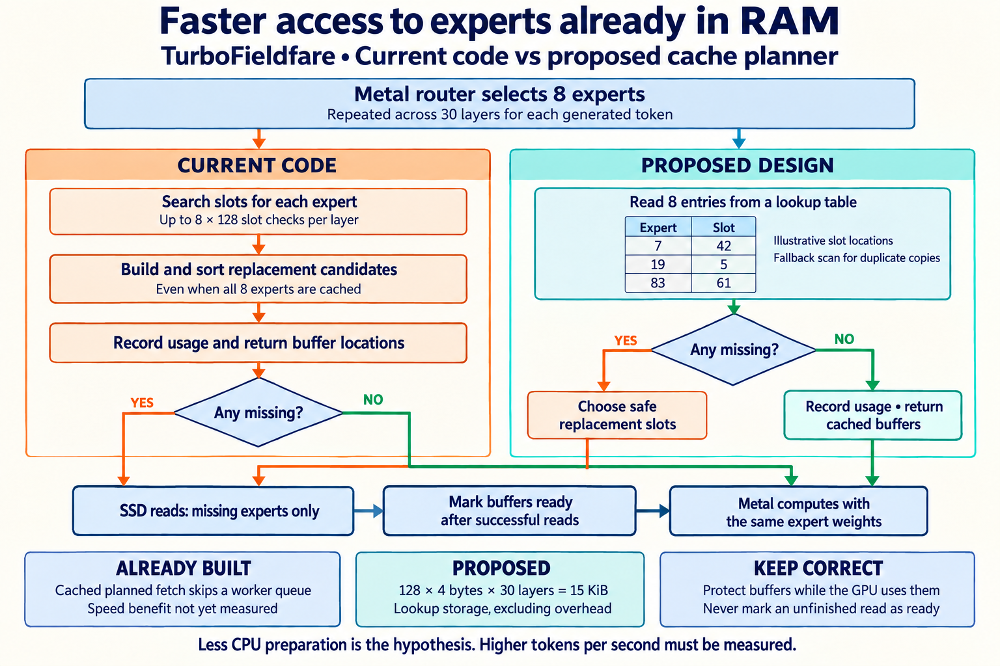

# Expert cache: current code and proposed design

Design review, 10 September 2026. Proposal only. No runtime changes made for this design request.

## What exists

Metal selects eight routed experts in each of 30 layers for every decoded token. The CPU locates their buffers before the routed computation can proceed.

In Sources/TurboFieldfare/Infrastructure/Streaming/PreadExpertStreamer.swift, makeExpertCachePlan scans slotExpert for each requested expert. At 128 slots, this is up to 1,024 slot checks per layer, or 30,720 across 30 layers per token. This is an upper bound on loop checks, not an observed cost or predicted speedup. It also filters and sorts eviction candidates even when misses is empty.

Existing cache hits already avoid SSD reads. ModelExpertIO.fetchRoutedExperts(plan:) already has a built, unbenchmarked shortcut that returns buffer views without a global worker-queue hop for unmeasured, fully cached planned requests. The measurement-enabled path and unplanned overload still use their existing queue paths.

## Proposed changes, in order

1. Skip eviction-candidate construction and sorting when there are no misses. Continue updating useClock, expert-use counts and slot recency under cacheLock. Return the same plan. This is the smallest experiment.
2. Add expertToSlot, a per-layer Int32 array sized from layout.expertsPerLayer and initialized to -1. For ordinary distinct requests, obtain eight candidate slots with eight indexed reads, validate them against current slot ownership and reservations, then use the no-miss return.
3. Retain the existing miss policy and bounded reads. More changes to eviction or GPU execution are outside this proposal.

Example: expertToSlot[19] = 5 means that expert 19 is ready in slot 5. The entry points to the existing buffer; it does not copy or approximate weights.

For this model, 128 entries × 4 bytes × 30 layers = 15,360 bytes, or 15 KiB of element storage, excluding array and allocation overhead. The weights, routing, context capacity and expert-cache size stay the same.

## Correctness requirements

- Keep reverse mappings and slotExpert synchronized under cacheLock.
- Clear or repoint a victim's mapping when reserving its slot for replacement, before reads begin.
- Publish ready mappings only when the entire existing read batch succeeds. Preserve failed-batch behavior.
- Preserve the current choice of the first unreserved matching slot. Duplicate requests and overlapping prefill plans can leave duplicate resident copies. Map to the lowest matching resident slot, use a fallback scan if it is reserved, and repoint when that copy is evicted.
- Preserve avoidingSlots behavior. Ready buffers may be shared for reading; protected buffers may not be overwritten.
- Reset mappings with streamer lifetime. Never expose loading or invalid buffers.

## Why this may help, and how to decide

This reduces CPU planning between GPU operations. It cannot remove attention costs, router synchronization, expert arithmetic, or cold SSD reads. When those dominate, token speed may barely change.

Compare separately: original baseline, existing queue shortcut, no-miss sorting bypass, then reverse lookup. Use the same release setup, model, prompts, seed, context and 128 slots. Compare aggregate generated tokens divided by aggregate decode seconds over matched warmed runs. Check identical plan assignments, output tokens, failed reads, duplicate IDs and protected prefill slots. Report memory and first-response time separately.

The instrumented fetch path currently differs from production. Do not use its timings alone to claim the production shortcut's benefit. Keep a change only after correctness holds and repeatable useful improvement is measured.

## Image provenance

Generated and edited using the built-in image generator. Final image visually checked for the hit and miss routes. Orange miss paths enter SSD reads; green hit paths bypass them. The diagram simplifies bookkeeping on the miss path.

### Generation prompt

Use case: infographic-diagram.
Create a clear, readable landscape engineering comparison for a user with dyslexia. Light ivory background, dark navy large sans-serif text, generous spacing, restrained orange for current work, teal for proposed work. Flat precise arrows and boxes. No decorative chip art. Title: "Faster access to experts already in RAM". Subtitle: "TurboFieldfare • Current code vs proposed cache planner".

Two equal columns, left CURRENT CODE and right PROPOSED DESIGN. At top spanning both columns: "Metal router selects 8 experts" then small caption "Repeated across 30 layers for each generated token". Branch this input into both columns.

LEFT vertical boxes:
"Search slots for each expert"
small supporting label "Up to 8 × 128 slot checks per layer"
then
"Build and sort replacement candidates"
small label "Even when all 8 experts are cached"
then
"Record usage and return buffer locations"
then a diamond "Any missing?"
YES arrow to bottom shared SSD path. NO arrow to bottom shared Metal path.

RIGHT vertical boxes:
"Read 8 entries from a lookup table"
Include a tiny illustrative table with headings "Expert" and "Slot", rows "7 → 42", "19 → 5", "83 → 61". Caption "Illustrative slot locations". This is index metadata, not expert weights.
then diamond "Any missing?"
NO clearly green arrow to box "Record usage • return cached buffers" then directly shared Metal path.
YES amber arrow to box "Choose safe replacement slots" then shared SSD path.

Bottom shared paths: a small box "SSD reads: missing experts only" with arrow to "Publish lookup entries after successful reads", then arrow to "Metal computes with the same expert weights". Both NO branches must bypass SSD and join that same Metal box.

Three separated footer notes:
"ALREADY BUILT" / "Cached planned fetch skips a worker queue" / "Speed benefit not yet measured"
"PROPOSED" / "128 × 4 bytes × 30 layers = 15 KiB" / "Extra lookup metadata only"
"KEEP CORRECT" / "Protect buffers while the GPU uses them" / "Never mark an unfinished read as ready"

Final unobtrusive line: "Less CPU preparation is the hypothesis. Higher tokens per second must be measured."
Accuracy: Both existing and proposed hit paths already avoid SSD reads. Do not imply current hits read SSD. Proposed skips replacement sorting only for all-hit requests. No 128x or numeric throughput gain claim. This is CPU cache planning between GPU operations, not a new Metal kernel. No claim this removes all locks or all queue hops. Expert selections and weights identical. Keep all arrows causal and readable, all labels exact and spelling correct. Output high-resolution wide landscape poster.

### Correction prompt

Edit this comparison diagram. Preserve its layout, typography, colors and existing text except the precise corrections below.
CRITICAL arrow correction: the orange YES branch from proposed "Choose safe replacement slots" must route LEFT to the "SSD reads: missing experts only" box. It must NOT point directly to the publish box. Both columns' YES paths must enter SSD reads. Then one arrow runs SSD reads -> publish -> Metal. Both NO branches still bypass SSD.
Change shared box "Publish lookup entries after successful reads" to "Mark buffers ready after successful reads" because both implementations do this; only the proposed implementation also maintains a reverse lookup.
Replace the little sentence "This is index metadata, not expert weights." with "Fallback scan for duplicate copies".
In the PROPOSED footer change "Extra lookup metadata only" to "Lookup storage, excluding overhead".
Leave everything else unchanged. Do not draw any miss path that skips SSD reads.

